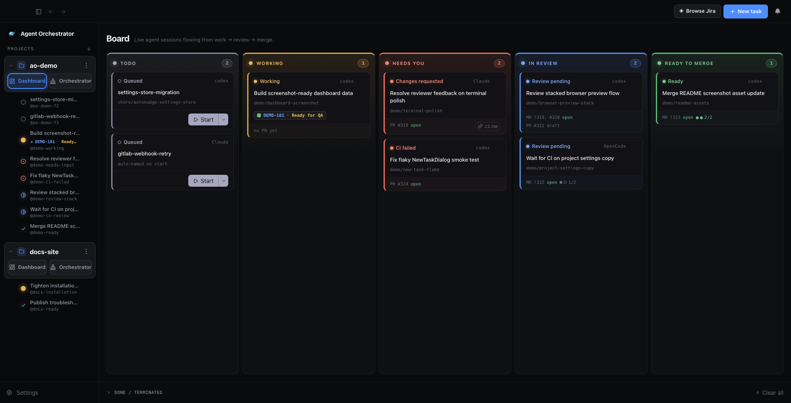
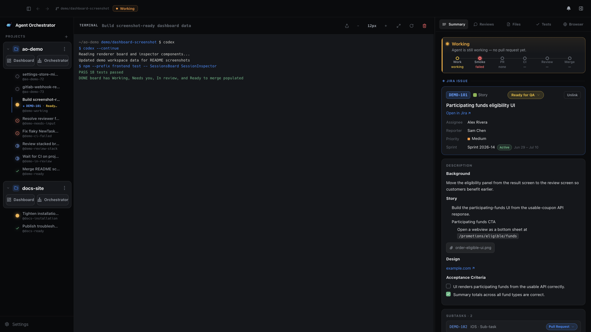
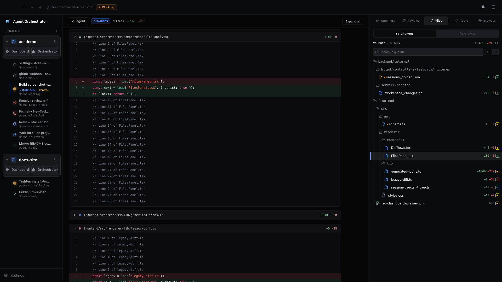
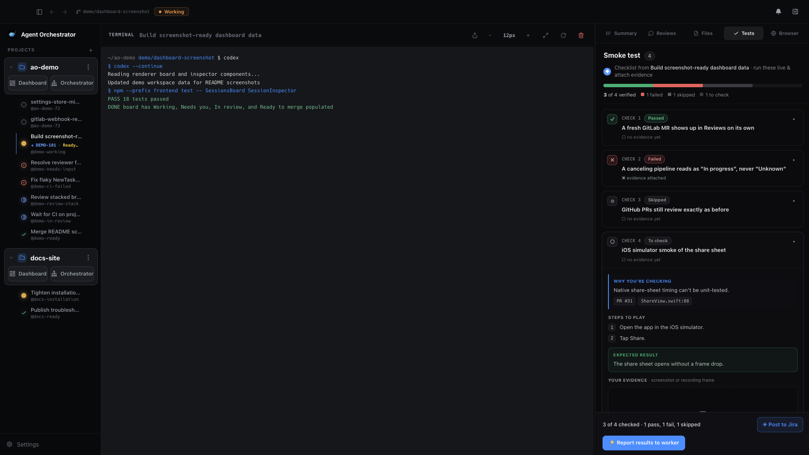
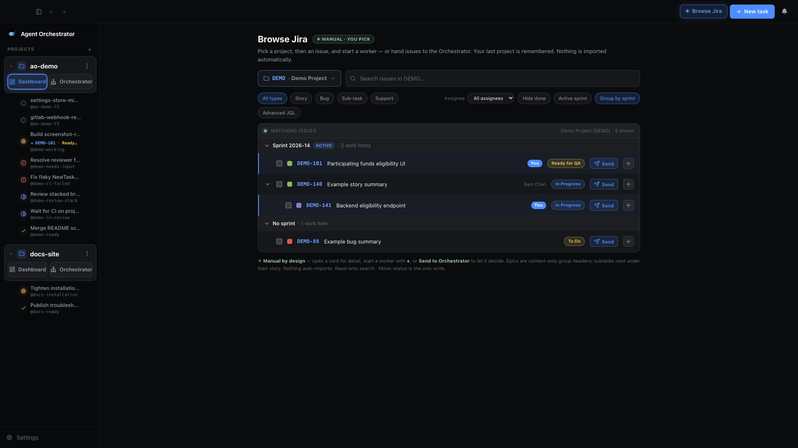
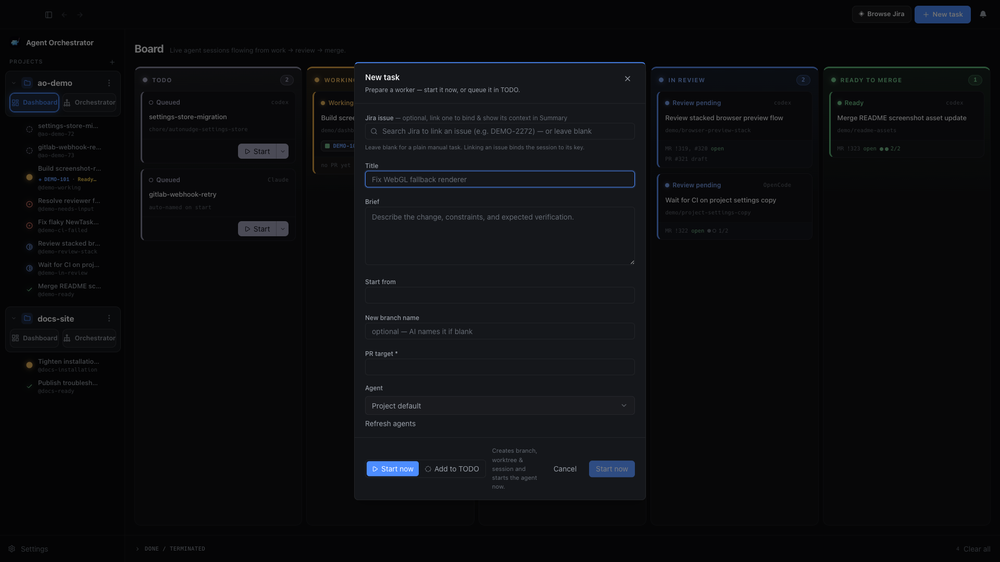
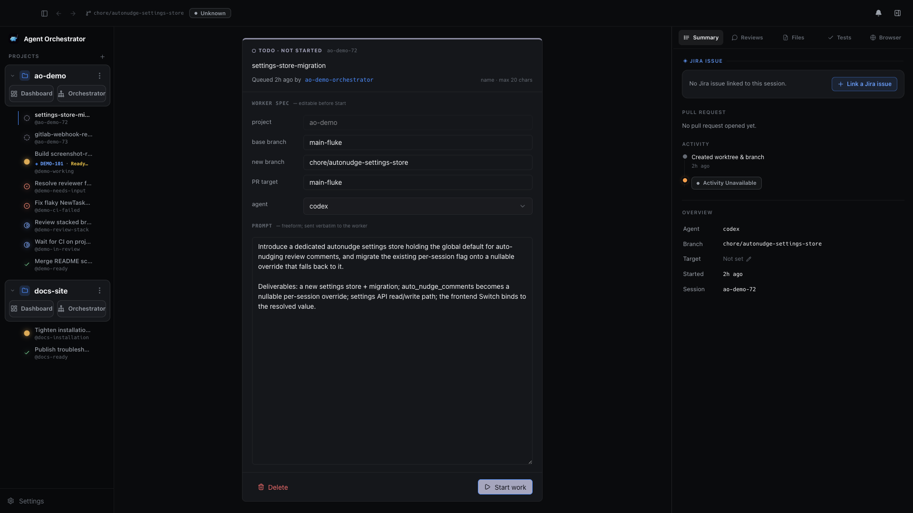
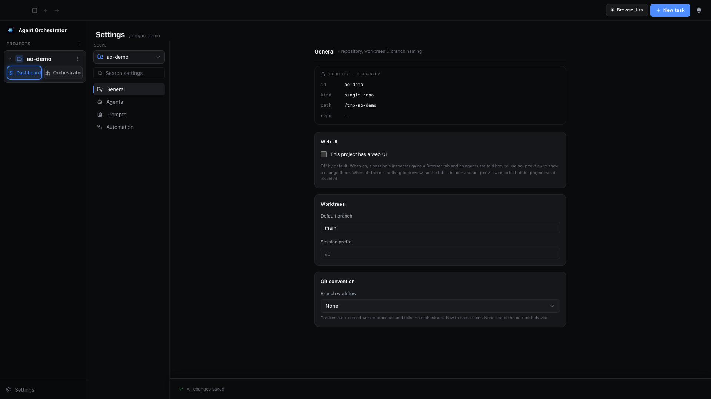
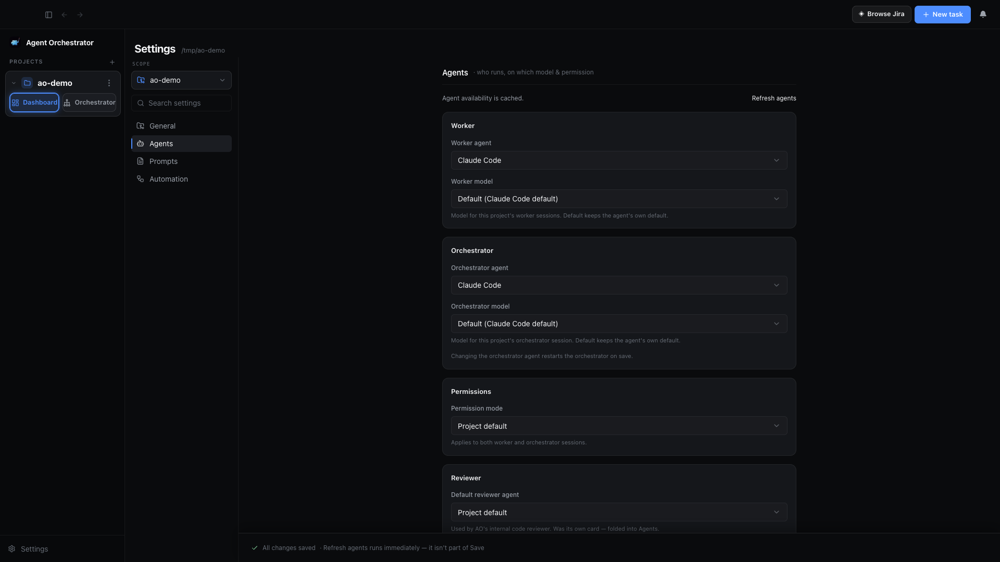
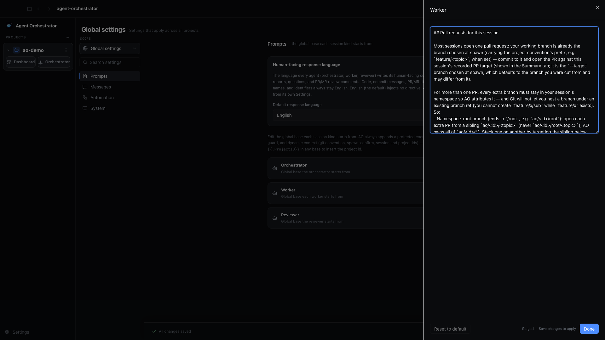

<div align="center">
  

# Agent Orchestrator

**The orchestration layer for parallel AI coding agents**

[](LICENSE)
[](https://github.com/AgentWrapper/agent-orchestrator)

An Agentic IDE that supervises parallel AI coding agents in isolated workspaces, with complete control and automatic feedback loops from CI failures, review comments, and merge conflicts.

> **This is a fork** of [AgentWrapper/agent-orchestrator](https://github.com/AgentWrapper/agent-orchestrator).
> It tracks upstream and adds a review-and-verify layer on top: a diff reviewer in the
> session rail, human-played smoke-test checklists, GitLab merge-request write-back, and
> Jira issue context. Development happens on the **`main-fluke`** branch, which is this
> repository's default branch. Everything below describes that branch.


</div>

---

## What is Agent Orchestrator?

Agent Orchestrator is a meta-harness agent IDE for running AI coding agents in parallel. It gives terminal-based agents like Claude Code, Codex, Cursor, Aider, Goose, and others a shared workspace where their sessions, terminals, branches, pull requests, and feedback loops can be supervised from one place.

The agents still do the coding. AO provides the harness around them: isolated workspaces, live terminal access, session state, PR awareness, and automatic loops that send CI failures, review comments, and merge conflicts back to the right agent. Instead of manually coordinating a pile of agent terminals, AO turns parallel agent work into a managed workflow.

## Why Agent Orchestrator?

AI coding agents become much more useful when they can work in parallel, but parallel work gets messy quickly. Branches overlap, terminals get lost, CI failures need follow-up, review comments need replies, and merge conflicts have to reach the right worker.

Agent Orchestrator is built to keep that loop visible and manageable. It helps you:

- Start multiple agents from the same project without mixing their work
- Keep every session in a separate git worktree
- See which agents are working, waiting, finished, or blocked
- Route CI failures, review comments, and merge conflicts back to the right session
- Read what an agent actually changed, without leaving the app
- Use different agent CLIs through one common supervisor

## How it works

At a high level, Agent Orchestrator follows a simple loop:

1. Add a project you want agents to work on.
2. Start one or more sessions from the desktop app or CLI.
3. AO creates an isolated git worktree for each session.
4. AO launches the selected coding agent in that session's terminal runtime.
5. The local daemon watches session state, terminal activity, pull requests, CI, and review feedback.
6. The desktop app and CLI show the current state and let you send follow-up instructions to the right session.

The result is a local control layer for agentic coding: agents still do the coding, while Agent Orchestrator keeps their workspaces, status, terminals, and feedback loops organized.

## Features

The desktop app is the main control surface: projects on the left, active sessions in the center, and the selected session's terminal, issue context, changed files, smoke-test checklist, review state, and browser preview in the inspector rail.

<table>
  <tr>
    <td width="36%">
      <h3>Parallel agent sessions</h3>
      <p>Start multiple coding agents from the same project without mixing files, branches, terminals, or pull request state. The board groups every session by what it needs from you next.</p>
    </td>
    <td width="64%">
      
    </td>
  </tr>
  <tr>
    <td width="36%">
      <h3>Terminal, status and issue context together</h3>
      <p>Attach to the worker terminal while a readiness strip tracks the session from work through smoke, PR, CI, review and merge. A linked Jira issue renders inline, with its description, subtasks and a status move.</p>
    </td>
    <td width="64%">
      
    </td>
  </tr>
  <tr>
    <td width="36%">
      <h3>Read the diff before you trust it</h3>
      <p>The Files tab lists everything the session changed against its target branch, as a folder tree or a flat list. Picking a file opens a stacked, unified diff in the centre pane; oversized files stay collapsed until you ask for them.</p>
    </td>
    <td width="64%">
      
    </td>
  </tr>
  <tr>
    <td width="36%">
      <h3>Smoke tests a human actually plays</h3>
      <p>A worker writes a short checklist for what tests cannot cover. You play each case in the Tests tab, record pass/fail/skip, attach a screenshot or clip, then send the results back to the worker or post them to the linked Jira issue.</p>
    </td>
    <td width="64%">
      
    </td>
  </tr>
  <tr>
    <td width="36%">
      <h3>Start work from the issue</h3>
      <p>Browse a Jira project by text, key or raw JQL, filtered by type, assignee, done state and active sprint. Results group by sprint and nest subtasks under their story. Start a worker from an issue through the task dialog, or hand a selection to the orchestrator and let it decide. Nothing is imported automatically.</p>
    </td>
    <td width="64%">
      
    </td>
  </tr>
  <tr>
    <td width="36%">
      <h3>Say where the work lands, up front</h3>
      <p>Spawning a task takes an optional issue to bind, a title and brief, the branch to start from, the new branch name, the PR target branch, and which agent runs it. Start it immediately, or queue it in TODO.</p>
    </td>
    <td width="64%">
      
    </td>
  </tr>
  <tr>
    <td width="36%">
      <h3>Queued work stays editable</h3>
      <p>A task queued in TODO has not launched its agent yet, so the whole worker spec — branches, PR target, agent and the prompt itself — stays editable. Start work once the brief is right.</p>
    </td>
    <td width="64%">
      
    </td>
  </tr>
</table>

Also in the session rail:

- **Reviews** — reviewer runs, PR/MR review threads, and per-session toggles to auto-send unresolved comments to the worker and to auto-resolve a thread once your side replies.
- **Browser** — an opt-in preview of the session's local dev server, for projects whose settings declare a web UI.

## What this fork adds

Everything above the line is upstream's product. These are the parts this fork built on top.

**Reviewing the work**

- **Files tab, Changes mode.** Every file the session touched, diffed from the merge base of its target branch against the working tree — so uncommitted and untracked work shows up too. Folder tree or flat list, a filename filter, per-file add/delete counts, a dot on files not yet committed, and a marker following whichever file you are reading in the stacked diff. Files over 500 changed lines, and everything past a 2000-line budget, stay collapsed until expanded. Diffs are unified and read-only. (A second **Browse** mode for the whole worktree is visible but not yet enabled.)
- **Clickable file references in the terminal.** A path an agent prints — absolute, `~/`-relative, workspace-relative or a bare filename, with an optional `:line` — opens a read-only code viewer in the centre pane, scrolled to that line, with a gutter marking lines that are added, modified or removed but not yet committed. Absolute paths resolve anywhere on disk, not only inside the worktree. Recognition is limited to files whose extension is one of a fixed set of code extensions.

**Verifying the work**

- **Smoke-test checklists.** A worker is instructed to author a checklist — name, why it matters, steps, expected result, and the PR and `file:line` it covers — once its own checks pass and before it opens a PR, via `ao smoke set`. You then play the cases in the Tests tab: pass, fail or skip, a note, and evidence images or video with a zoomable lightbox. Results go back to the worker session with one button, or to the linked Jira issue as a comment with the evidence attached. Evidence is stored outside the checkout and purged after 30 days by default. The checklist is prompt-driven guidance, not a gate: nothing blocks a PR that has none, and workers are told to skip it for pure-logic changes.
- **Approval progress.** Where the forge reports approval counts, review surfaces show approved-of-required with a meter, and a project can require a minimum number of approvals before AO calls a session ready to merge. Approval counts come from GitLab only.

**Working with forges and trackers**

- **GitLab merge requests.** MR state, draft status, conflicts, mergeability, approvals, the head pipeline and its individual jobs — including failed jobs past the first page of results. Review threads are read from resolvable MR discussions, and AO can **write** back: reply to a thread, resolve it, and retarget an MR's branch. Opt in per session and a thread resolves itself once your side replies.
- **Retargeting a PR.** A session's target branch is shown in the inspector with where it came from, and editing it retargets the open pull request or merge request on GitHub or GitLab before anything is stored locally.
- **Jira.** Browse issues by text, key or raw JQL with assignee, type, done and active-sprint filters, grouped by sprint and nested three levels deep through epics and subtasks. A read-only detail drawer, plus a sanctioned status move. Link an issue to a session and its context renders in the Summary tab, with inline image and video previews. AO writes exactly three things to Jira: a status transition, an attachment, and a comment.
- **Issue intake.** A project can poll its GitHub or GitLab tracker and start one worker session per eligible issue.

**Tuning it per project**

Settings is one two-pane shell with a scope switcher: global defaults, then any project as an override. Changes save as you make them.

<table>
  <tr>
    <td width="36%">
      <h3>Repository, worktrees and branch naming</h3>
      <p>Point a project at its default branch, set the prefix its session ids use, and pick a branch workflow that tells auto-naming and the orchestrator how branches should look. The web-UI switch is off by default; turning it on is what adds the Browser tab.</p>
    </td>
    <td width="64%">
      
    </td>
  </tr>
  <tr>
    <td width="36%">
      <h3>Who runs, on which model</h3>
      <p>Workers and the orchestrator get their own agent and model, so a project can run a cheaper model for workers than for the session coordinating them. Permission mode and the reviewer agent sit alongside them.</p>
    </td>
    <td width="64%">
      
    </td>
  </tr>
  <tr>
    <td width="36%">
      <h3>Editable prompt bases</h3>
      <p>The base prompt each session kind starts from is editable, globally and then per project on top. AO always appends its own coordination floor, confidentiality guard and dynamic context, and those are never editable. Reset to default at any time.</p>
    </td>
    <td width="64%">
      
    </td>
  </tr>
</table>

- A response language setting, global with a per-project override, that makes agents write their human-facing output in that language while code, commits and PR text stay English.
- Per-project issue intake and approval rules, and additional system prompts appended per session kind.

**Living in the app**

- "Open in" for Terminal, Finder, Xcode, Android Studio and VS Code, shown only when the app and the relevant project files are present (macOS only).
- Drag-and-drop project reordering in the sidebar, remembered per machine, and a daemon status button that opens a read-only popover showing when each background loop last ran and when it runs next.

## Supported Agents

AO ships adapters for 23 worker agent harnesses:

 `claude-code` ·  `codex` ·  `aider` ·  `opencode` ·  `grok` ·  `droid` · `amp` · `agy` ·  `crush` ·  `cursor` ·  `qwen` ·  `copilot` ·  `goose` · `auggie` ·  `continue` ·  `devin` · `cline` ·  `kimi` ·  `kiro` ·  `kilocode` ·  `vibe` ·  `pi` · `autohand`

Reviewer agents are configured separately. The current reviewer harnesses are:

 `claude-code` ·  `codex` ·  `opencode`

**If it runs in a terminal, it runs on Agent Orchestrator.**

## Install

This fork is not published to npm. `npm install -g @aoagents/ao` installs **upstream's** CLI, which does not contain any of the work described above.

### What you need

To **run** the app:

| Tool                   | Why                                                                                                                                          |
| ---------------------- | -------------------------------------------------------------------------------------------------------------------------------------------- |
| `git` 2.25 or newer    | Every session gets its own worktree. A missing git is fatal; an older one only warns.                                                        |
| `tmux`                 | Backs each session's terminal on macOS and Linux. **Windows needs nothing** — ConPTY is built in.                                            |
| At least one agent CLI | AO supervises agents, it does not bundle one. The app starts without any, but you cannot spawn a session for a harness whose CLI is missing. |

To **build from source**, additionally:

| Tool                                | Why                                                                                                      |
| ----------------------------------- | -------------------------------------------------------------------------------------------------------- |
| Go 1.25 or newer (`backend/go.mod`) | Builds the daemon. The frontend build shells out to it, so Go must be on `PATH` even though you run npm. |
| Node 20 or newer                    | Builds the Electron app                                                                                  |

Optional, and only for the features that use them:

| Tool                                    | Enables                                                                             |
| --------------------------------------- | ----------------------------------------------------------------------------------- |
| `gh`                                    | GitHub auth without setting a token yourself                                        |
| `glab`                                  | GitLab auth without setting a token yourself                                        |
| Xcode, Android Studio, VS Code, Ghostty | The matching "Open in" entries, which only appear when the app is installed (macOS) |

You do **not** need to put `ao` on your `PATH` for the app to work — the daemon pins `PATH` inside the sessions it spawns. Put it there if you want to drive AO from your own shell.

### Build from source

```bash
git clone https://github.com/f1uke/agent-orchestrator.git
cd agent-orchestrator/frontend
npm ci
npm run package
```

`npm run package` builds the Go daemon first, then produces the desktop app under `frontend/out/`. Use `npm run make` instead if you want a distributable installer.

### Prebuilt desktop builds

This fork publishes an automated nightly desktop build from `main-fluke`, on every day the branch has new commits. They are **pre-releases**, so `/releases/latest` does not resolve to them — browse the full list instead:

| Platform | Download                                                                           |
| -------- | ---------------------------------------------------------------------------------- |
| Windows  | [Latest nightly `Setup.exe`](https://github.com/f1uke/agent-orchestrator/releases) |
| macOS    | Not currently published — [build from source](#build-from-source)                  |
| Linux    | Not currently published — [build from source](#build-from-source)                  |

> The macOS and Linux legs of the nightly workflow do not currently succeed, so only the
> Windows installer is attached to each nightly release. Upstream's own releases do build
> for all three platforms, but they do not contain this fork's changes.

### Connect a forge

AO reads credentials from the environment first and otherwise falls back to a CLI you have already logged in with. Pick whichever row suits you — you do not need both. Exporting from your login shell's rc file is enough: the app resolves your login-shell environment before it starts the daemon, so a Dock or Finder launch sees the same variables a terminal launch does.

**GitHub** works out of the box if `gh` is authenticated:

```bash
gh auth login              # AO then shells out to `gh auth token`
export AO_GITHUB_TOKEN=…   # or set a token yourself; this wins over gh
```

**GitLab is opt-in.** Nothing GitLab-related is wired until `AO_GITLAB_HOST` names a host, so a GitHub-only setup is unaffected:

```bash
export AO_GITLAB_HOST=gitlab.example.com   # required to enable GitLab at all
glab auth login --hostname gitlab.example.com
export AO_GITLAB_TOKEN=…                   # or set a token yourself
```

`AO_GITLAB_HOST` accepts a comma-separated list, but **only the first host is wired**. `GITLAB_TOKEN` also works, though `ao doctor` does not currently look at it — the daemon will be authenticated while doctor reports a warning.

### Connect Jira

Jira has no settings screen — it is configured entirely from the environment, and `ao doctor` does not check it. The minimum is a URL, the account email and an API token.

Create the token at **[id.atlassian.com → Security → API tokens](https://id.atlassian.com/manage-profile/security/api-tokens)** ("Create API token"). It is shown once, so copy it before closing the dialog. Authentication is HTTP Basic over your email plus the token, so this must be an Atlassian **account API token**, not a project or OAuth credential — see [Atlassian's guide](https://support.atlassian.com/atlassian-account/docs/manage-api-tokens-for-your-atlassian-account/) if you need the walkthrough.

```bash
export AO_JIRA_URL=https://your-org.atlassian.net
export AO_JIRA_EMAIL=you@your-org.com
export JIRA_API_TOKEN=…    # the token you just created
```

Each value has an AO-prefixed name and a generic fallback; either works.

| Value | Checked in order                  |
| ----- | --------------------------------- |
| URL   | `AO_JIRA_URL`, `JIRA_SERVER`      |
| Email | `AO_JIRA_EMAIL`, `JIRA_LOGIN`     |
| Token | `AO_JIRA_TOKEN`, `JIRA_API_TOKEN` |

So `JIRA_API_TOKEN` on its own is enough; `AO_JIRA_TOKEN` only matters if you want to point AO at a different token than the rest of your tooling uses.

If the URL or email is still unset, AO falls back to reading those two values — never the token — out of `~/.config/.jira/.config.yml` (or wherever `JIRA_CONFIG_FILE` points). Set both variables explicitly if you would rather that never happen.

### Check your setup

`ao doctor` verifies the whole chain and tells you exactly what is missing:

```console
$ ao doctor
Core:
PASS config: runFile=~/.ao/running.json dataDir=~/.ao/data port=3001
PASS daemon: ready pid=77118 port=3001

Tools:
PASS git: /usr/bin/git (version 2.50.1; supports worktrees)
PASS tmux: /opt/homebrew/bin/tmux (tmux 3.6a)

Agent harnesses:
PASS claude-code: claude resolves to ~/.local/bin/claude

GitHub:
PASS github-token: gh token valid for <you> (scopes: repo, workflow, …)
```

The GitLab section only appears once `AO_GITLAB_HOST` is set. Add `--json` for machine-readable output.

Read the warnings, not just the failures: a missing `tmux` or a missing agent CLI is reported as `WARN`, but neither one lets you actually start a session. `ao doctor` can come back with zero failures on a machine that cannot spawn anything.

## Documentation

| Document                                                         | Start here when you need                                                                     |
| ---------------------------------------------------------------- | -------------------------------------------------------------------------------------------- |
| [docs/architecture.md](docs/architecture.md)                     | Backend mental model, lifecycle, persistence, CDC, status derivation, and daemon boundaries. |
| [docs/backend-code-structure.md](docs/backend-code-structure.md) | Package ownership and where each backend concern belongs.                                    |
| [docs/cli/README.md](docs/cli/README.md)                         | CLI behavior and daemon route mapping.                                                       |
| [docs/STATUS.md](docs/STATUS.md)                                 | Shipped-versus-in-flight inventory of the core daemon and frontend, inherited from upstream. |
| [docs/stack.md](docs/stack.md)                                   | Library, runtime, and dependency decisions.                                                  |

## Telemetry

The daemon's own telemetry is **off by default** — see the `AO_TELEMETRY_*` variables below.

Agent Orchestrator's Electron renderer sends anonymous usage events to PostHog for reliability and product understanding, and PostHog session recording is enabled with local paths and local URLs redacted before transmission. Set `VITE_AO_POSTHOG_KEY` to an empty string before building to disable transmission. See [docs/telemetry.md](docs/telemetry.md).

## Testing

```bash
# Backend tests
cd backend
go test -race ./...

# Frontend tests
cd frontend
npm test

# Full CI validation locally
npx @redwoodjs/agent-ci run --all
```

---

## Configuration

All configuration is environment-driven. The daemon has no config file of its own; for forge
credentials it reads the environment first and otherwise falls back to the `gh` and `glab`
CLIs' existing logins. Jira is environment-only.

| Variable                          | Default                    | Purpose                                           |
| --------------------------------- | -------------------------- | ------------------------------------------------- |
| `AO_PORT`                         | `3001`                     | HTTP bind port                                    |
| `AO_REQUEST_TIMEOUT`              | `60s`                      | Per-request timeout                               |
| `AO_SHUTDOWN_TIMEOUT`             | `10s`                      | Graceful shutdown cap                             |
| `AO_SESSION_IDLE_CLOSE`           | `72h`                      | Idle session auto-close; `0` disables             |
| `AO_RUN_FILE`                     | `~/.ao/running.json`       | PID/port handshake                                |
| `AO_DATA_DIR`                     | `~/.ao/data`               | SQLite data directory                             |
| `AO_AGENT`                        | `claude-code`              | Compatibility agent adapter                       |
| `AO_ALLOWED_ORIGINS`              | `app://renderer`           | CORS origins, comma-separated                     |
| `AO_TELEMETRY_EVENTS`             | `off`                      | Local event capture                               |
| `AO_TELEMETRY_METRICS`            | `off`                      | Local metric capture                              |
| `AO_TELEMETRY_REMOTE`             | `off`                      | Remote exporter (`off` \| `posthog`)              |
| `AO_TELEMETRY_POSTHOG_KEY`        | -                          | PostHog project key                               |
| `AO_TELEMETRY_POSTHOG_HOST`       | `https://us.i.posthog.com` | PostHog ingestion host                            |
| `AO_GITHUB_TOKEN`, `GITHUB_TOKEN` | -                          | GitHub auth; otherwise falls back to `gh` login   |
| `AO_GITLAB_HOST`                  | -                          | Enables GitLab, see below                         |
| `AO_GITLAB_TOKEN`, `GITLAB_TOKEN` | -                          | GitLab auth; otherwise falls back to `glab` login |
| `AO_JIRA_URL`, `JIRA_SERVER`      | -                          | Jira base URL                                     |
| `AO_JIRA_EMAIL`, `JIRA_LOGIN`     | -                          | Jira account email                                |
| `AO_JIRA_TOKEN`, `JIRA_API_TOKEN` | -                          | Jira API token                                    |

The bind host is deliberately not configurable: the daemon is loopback-only, with no auth
or TLS.

### GitLab (self-hosted)

GitLab support is opt-in and additive: **if `AO_GITLAB_HOST` is unset, behavior
is unchanged** and only GitHub is wired, exactly as before this feature existed.

| Variable                           | Purpose                                                                                                                                                                                                 |
| ---------------------------------- | ------------------------------------------------------------------------------------------------------------------------------------------------------------------------------------------------------- |
| `AO_GITLAB_HOST`                   | Enables GitLab. Sets both the composite provider's host matcher and the REST API base (`https://<host>/api/v4`). Comma-separated values are accepted, but **only the first host in the list is wired**. |
| `AO_GITLAB_TOKEN` / `GITLAB_TOKEN` | Auth token for the configured host. If unset, the daemon falls back to the `glab` CLI login (`glab auth status --show-token`) for that host.                                                            |

GitLab support covers merge-request and pipeline observation, individual pipeline jobs,
approval counts, and review-thread and decision tracking. Issue intake is read-only. AO
writes three things back to GitLab: a reply on an MR discussion, resolving a discussion,
and retargeting an MR's branch. There is no approve, no merge, and no MR creation.

### Health Checks

```bash
curl localhost:3001/healthz   # Liveness probe
curl localhost:3001/readyz    # Readiness probe
```

---

## Contributing

This fork tracks [upstream](https://github.com/AgentWrapper/agent-orchestrator) and carries
its own work on `main-fluke`. If your change is about the shared product, upstream is
usually the better home for it; upstream runs the community, the Discord and the docs site.
Changes to what this fork adds belong here.

1. **Read the contributor contract** — see [AGENTS.md](AGENTS.md) for repo layout, daemon/API boundaries, and coding conventions
2. **Branch from `main-fluke`** and keep one issue per pull request
3. **Open a clear PR** — keep changes narrow, explain user-visible impact, link issues, include tests
4. **Match the gate** — `npm run lint`, `npm run frontend:typecheck`, and the tests for whatever you touched

---

## License

Apache License 2.0. See [LICENSE](LICENSE).
