# Agent Orchestrator Architecture

Agent Orchestrator is a long-running Go daemon that supervises multiple parallel AI coding agent sessions. Each session runs in an isolated git worktree with its own runtime, while the daemon coordinates lifecycle, observes external state, and routes feedback.

## Table of Contents

- [Mental Model](#mental-model)
- [System Overview](#system-overview)
- [Core Architectural Principles](#core-architectural-principles)
- [Component Architecture](#component-architecture)
- [Data Flows](#data-flows)
- [Persistence and CDC](#persistence-and-cdc)
- [Status Derivation](#status-derivation)
- [Lifecycle Management](#lifecycle-management)
- [Observation Loops](#observation-loops)
- [HTTP Layer](#http-layer)
- [Terminal Multiplexing](#terminal-multiplexing)

---

## Mental Model

The fundamental architecture follows a simple three-stage pipeline:

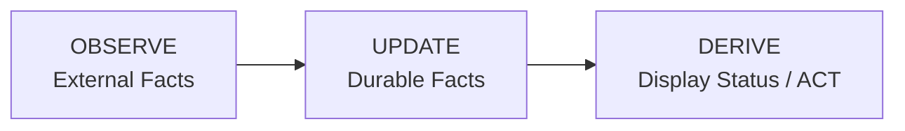

**Key insight:** Display status is never stored. It is computed at read time from durable facts.

### Durable Session Facts

The only persistent session state is:

- `activity_state` — What the agent last reported (`active`, `idle`, `waiting_input`,
  `parked`, `exited`). `waiting_input` and `parked` are NOT interchangeable:
  `waiting_input` means a permission prompt is open in the pane and the agent is
  blocked on the human, so nothing may be typed at it (a message would be eaten by
  the dialog and its trailing Enter could answer it); `parked` means the turn ended
  and the agent is sitting at an ordinary prompt, listening. Messages for a session
  that cannot receive one are HELD by the message queue, never dropped.
- `is_terminated` — Whether the session should be treated as over. An agent that ends
  its OWN session does NOT always land here: a worker holding a materialized worktree
  from which no pull request was ever opened has delivered nothing, so it is PARKED
  instead and the board reads `needs_input` rather than filing the task as finished.
  A park is `activity_state = 'parked'` plus `is_suspended` with `sleep_reason` of
  `undelivered`, and it keeps the worktree. An ending that does terminate runs the
  same crew fan-out `session_manager.Teardown` runs, so a crew's dev can never
  terminate out from under a live member. A parked session is discarded only
  deliberately: an interactive `Kill` REFUSES (409 `SESSION_HAS_UNDELIVERED_WORK`,
  naming the files, touching nothing) while its worktree holds work no PR carries,
  and `discardUncommitted` captures that work to `refs/ao/preserved/<session-id>`
  before the worktree goes. The background teardowns (auto-reclaim, cleanup,
  project teardown) keep their old policy: preserve the tree and retry later.
- `termination_*` — How the session ended: `source` (`agent` — the harness reported its
  own exit; `ao` — a teardown AO initiated; `runtime_gone` — the reaper inferred it from a
  missing runtime), `reason` (the harness's own end reason, or the named AO cause such as
  `kill` / `auto_reclaim` / `daemon_shutdown` / `discard_work` — the last for a kill
  somebody ordered knowing it would destroy uncommitted work), `last_state`,
  `transcript_path`, and
  `terminated_at`. Written by the lifecycle reducer on every terminal transition and
  cleared on respawn. `activity_state = 'exited'` alone cannot tell a worker that stopped
  by itself mid-task from one AO reclaimed, and that difference is what someone asking
  "why did it disappear?" needs.
- PR facts — `pr`, `pr_checks`, `pr_comment` tables

### What is NOT Durable

Display status like `working`, `needs_input`, `ci_failed`, `mergeable` are **computed at read time** by the service layer from the durable facts above.

---

## System Overview

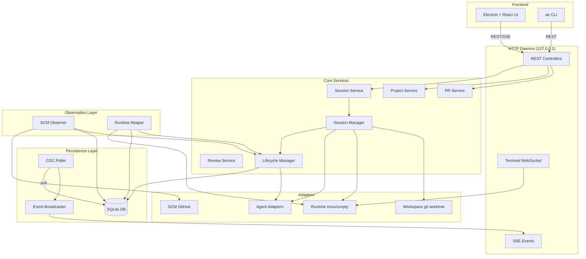

---

## Core Architectural Principles

### 1. Port-Based Design

Core code never depends on concrete implementations. All external systems are accessed through port interfaces defined in `backend/internal/ports/`:

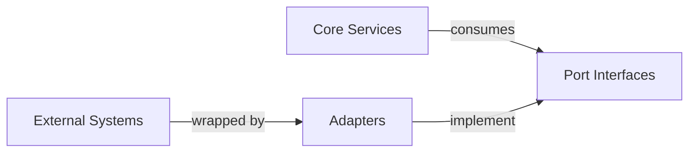

### 2. Durable Facts, Derived Status

Storage layer persists minimal facts. Service layer computes display status on-demand:

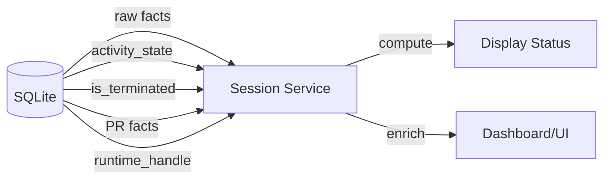

### 3. Observer Pattern

Observation is separated from action:

- **Observe layer** — SCM Observer, Runtime Reaper poll external state
- **Lifecycle layer** — Reduces observations into durable facts
- **Service layer** — Computes display status from facts

### 4. Change Data Capture

All durable changes flow through a CDC pipeline:

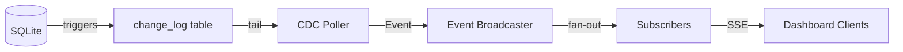

---

## Component Architecture

### Package Layout

```
backend/internal/
├── domain/              # Shared vocabulary and durable fact records
├── ports/               # Inbound/outbound interfaces
├── service/             # Controller-facing services
│   ├── project/         # Project CRUD
│   ├── session/         # Session read-model assembly
│   ├── pr/              # PR observation service
│   └── review/          # Code review service
├── session_manager/     # Internal session command engine
├── lifecycle/           # Durable session fact reducer
├── observe/             # Observation loops
│   ├── scm/             # SCM (GitHub) observer
│   └── reaper/          # Runtime liveness observer
├── storage/             # SQLite persistence
│   └── sqlite/          # DB, migrations, queries, stores
├── cdc/                 # Change-log poller and broadcaster
├── httpd/               # HTTP API, controllers, terminal mux
├── terminal/            # Terminal session protocol
├── adapters/            # Concrete adapter implementations
│   ├── agent/           # 23+ agent harnesses
│   ├── runtime/         # tmux/conpty runtimes + the claude-code socket path
│   ├── workspace/       # git worktree
│   ├── scm/             # GitHub
│   └── tracker/         # GitHub tracker
├── daemon/              # Production wiring
└── config/              # Environment-based configuration
```

### Message delivery

Every message AO injects into a session - `ao send`, lifecycle nudges, review
nudges - goes through one port method, `SendMessage`, on the runtime selected by
`adapters/runtime/runtimeselect`. Queueing, the crew rules and the input gate all
sit above it; the runtime only decides how the bytes reach the agent.

There are two ways they reach it:

- **The pane (tmux `send-keys`).** The default for all 23 harnesses. The message
  is typed into the pane's input line in chunks and submitted with a separate
  Enter, so it competes with whatever the human is typing there.
- **The session's own unix socket (`adapters/runtime/claudepeer`).** Only for
  claude-code, and only on Darwin/Linux. Claude Code registers every running
  session in `~/.claude/sessions/<pid>.json` - including the tmux pane it owns,
  which is what joins it to AO's runtime handle - and listens on a per-session
  socket. Handing the message to that socket leaves the input line alone
  entirely, carries an arbitrarily large message in one frame, and is atomic.

The socket is an undocumented interface with a version on it, so `claudepeer`
wraps the tmux runtime rather than replacing it and falls back to it, quietly and
automatically, on every uncertainty: an unfamiliar `peerProtocol`, a missing or
dead socket, a session that might be in `bypassPermissions` (which parks peer
messages instead of delivering them), a message the receiver's own duplicate and
rate guards would drop, or any incomplete write. The commit point is a complete
write of the frame, so a message lands on exactly one of the two paths, never
both.

`AO_CLAUDE_NATIVE_SEND` chooses how hard AO tries for the socket:

| value                          | behaviour                                                                           |
| ------------------------------ | ----------------------------------------------------------------------------------- |
| unset, or anything below       | **the default:** prefer the socket, fall back to the pane                           |
| `0` / `false` / `FALSE` / `no` | pane only; never touch the socket                                                   |
| `strict`                       | socket only; a send that cannot take it FAILS, naming the reason, and types nothing |

Under `strict` the refusal reaches the caller as `MESSAGE_NOT_DELIVERED`, carrying
the transport's reason:

```
$ ao send --session repo-2 --message "..."
send repo-2: message not delivered: AO_CLAUDE_NATIVE_SEND=strict refused the pane
fallback and the claude peer socket could not be used (reason=no-descriptor) ...
```

The default does not force the socket on purpose: the protocol is undocumented,
and if a Claude Code release changed it, a forced-socket default would make every
message in the system vanish silently - far worse than one being typed at
somebody. `strict` is opt-in, for someone deliberately hunting fallbacks.

#### Which wire a message took

The path and the reason are decided inside the transport, on facts only it has,
and the question gets asked hours later - so they are reported, never re-derived
higher up:

- **`ao send` prints it**, and it also rides the API as `delivery` on the send
  response:

  ```
  delivered: socket (claude's own message channel; from @agent-orchestrator-105)
  delivered: pane (typed into the terminal; reason=no-descriptor)
  ```

- **The daemon keeps it**: one JSON line per delivery in
  `<AO_DATA_DIR>/message-delivery.jsonl` (`~/.ao/data/` by default), carrying the
  time, the session, what triggered the send (`send`, `queue-drain`, `nudge`,
  `smoke-report`, `review-notify`, ...), the path, the reason, the sender name, the
  frame's `msg_id` and any error. It rolls over at 4 MiB, keeping one previous
  generation as `message-delivery.jsonl.1`. Read it with `tail`/`jq`.

Every path a message can travel is covered, not only the interactive `ao send`:
the held message drained later, the replay after a daemon restart, a nudge, a
report-back and the reviewer's brief take the same decision, and nobody watches
any of those being delivered.

A message delivered over the socket reaches the agent as a **peer message**,
which the receiving session labels as coming from another Claude session rather
than from its user. That is inherent to the interface: it has no frame that
injects a plain user prompt.

### Session ids, and Claude Code's own session names

Claude Code names every session after its worktree directory plus a random
suffix (`mobility-4734-chat-unsafe-url-whitelist-f5`) and shows the agent THAT
name, so an agent asked to identify itself answers with something that looks
like an AO session id and is not one. Pasted into `ao send` or `ao smoke list`
it used to resolve to nothing.

`controllers.SessionAlias` (mounted once, above `TaskScoped`, on the group that
carries every session route) resolves such a name to the AO session that owns
the same tmux pane and rewrites the `{sessionId}` path parameter, so every
route - and `TaskScoped`, which reads the same parameter - sees an ordinary AO
id. The pane is the only sound join: a crew's dev and qa share a worktree, a
branch and a display name, so cwd cannot tell them apart.

It never changes what a known id means. An id AO already has wins before
Claude's registry is read, and a name matching zero or several live sessions is
passed through so the handler returns its own 404.

Every resolved request carries `X-AO-Session-Resolved: <given> -> <ao id> (tmux
<handle>)`, and the CLI prints it to stderr. That is load-bearing rather than
decorative: because the two crew members are indistinguishable by name, a silent
substitution could message the wrong agent with nothing to show for it.

### Core Data Flow

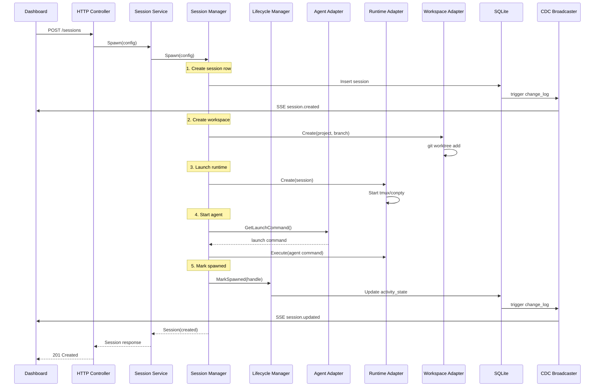

---

## Data Flows

### Session Spawn Flow

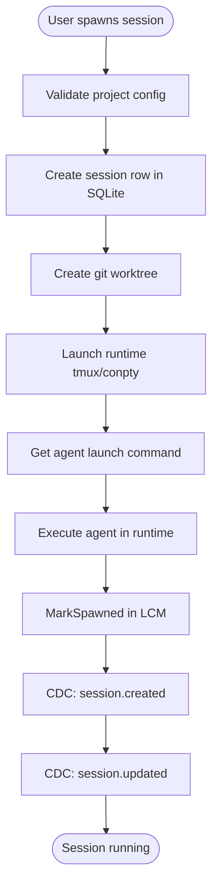

### Observation Flow

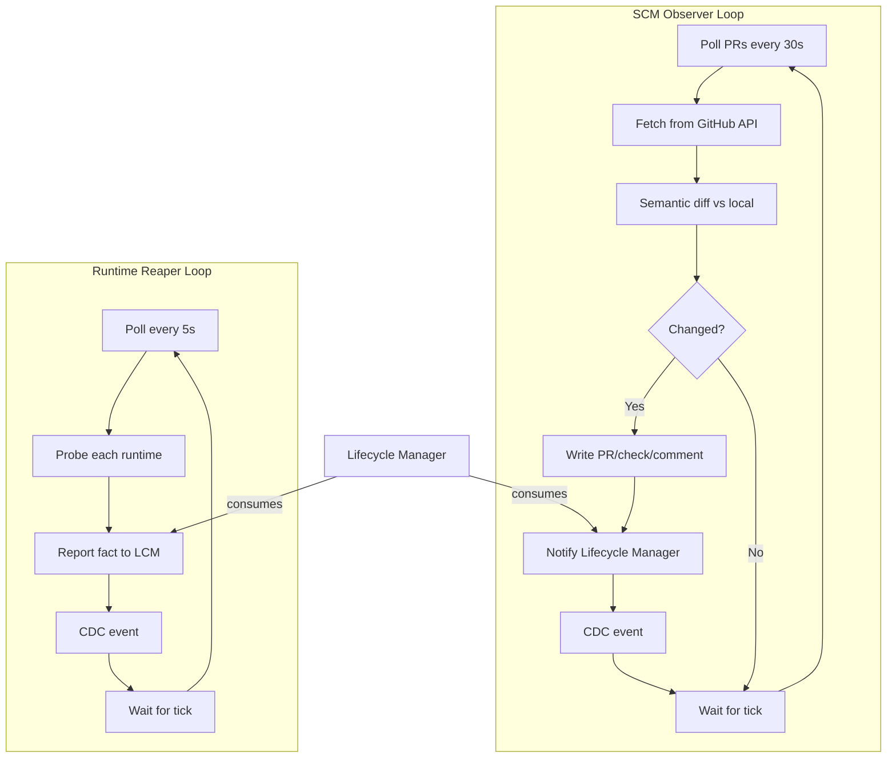

### Feedback Routing Flow

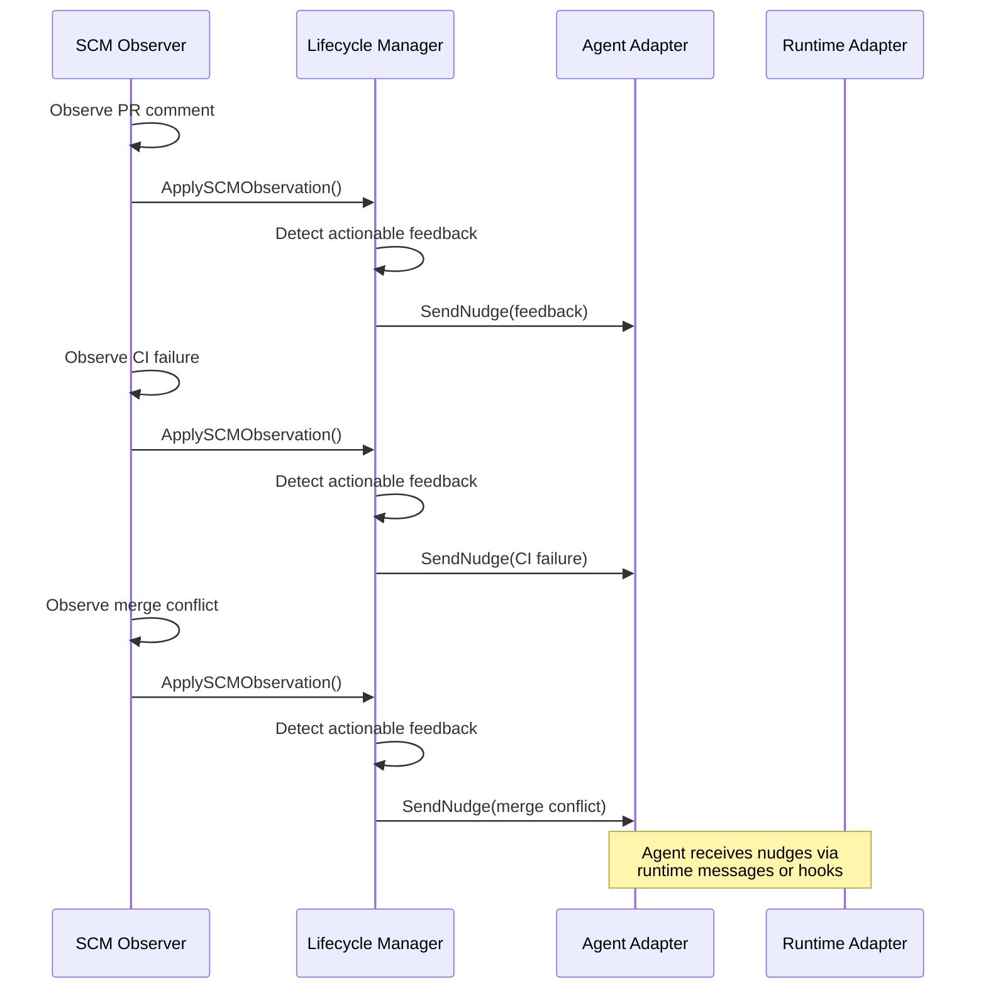

---

## Persistence and CDC

### SQLite Schema

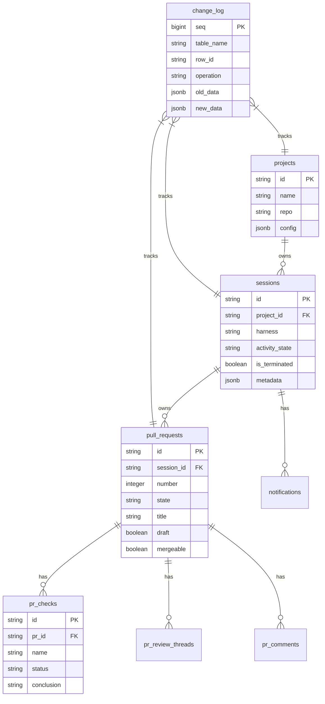

### CDC Pipeline

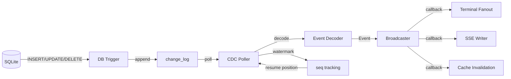

---

## Status Derivation

### Display Status Precedence

The `service.Session` computes display status from durable facts using this precedence (highest to lowest):

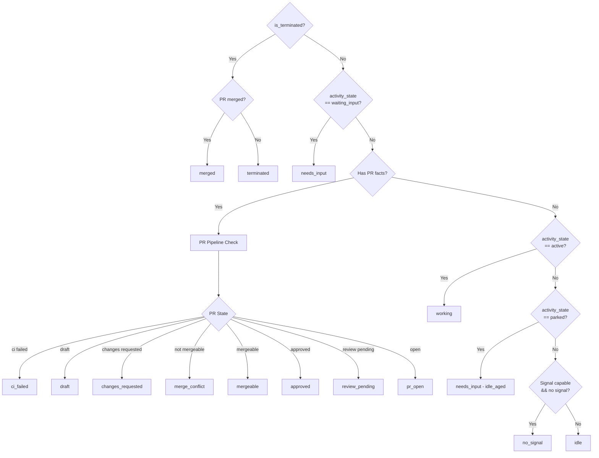

### PR Pipeline States

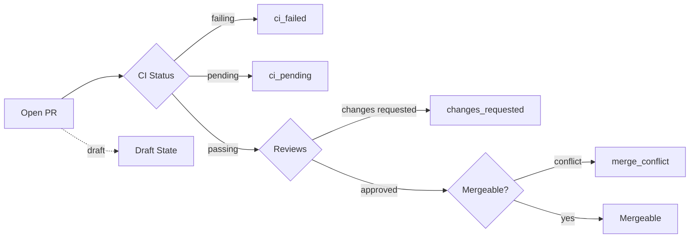

---

## Lifecycle Management

### Lifecycle Manager Responsibilities

The `lifecycle.Manager` is the **canonical write path** for all session lifecycle facts:

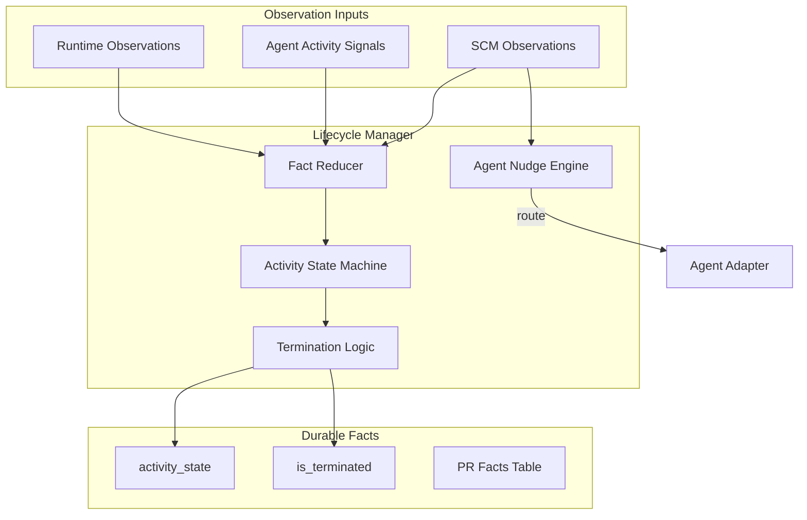

### Session State Machine

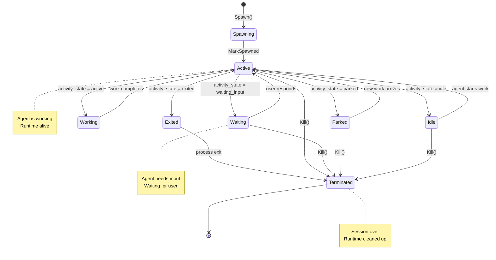

### Termination Guardrails

The lifecycle manager only terminates when **all** conditions are met:

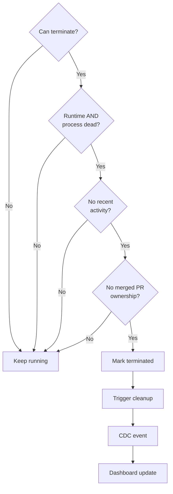

**Key principle:** Failed probes are NOT proof of death. A session is only terminated when the runtime and process are **both** clearly dead and recent activity doesn't contradict that.

---

## Observation Loops

### SCM Observer

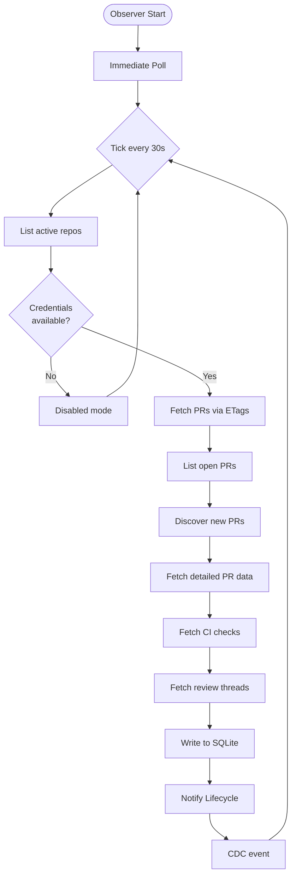

### Runtime Reaper

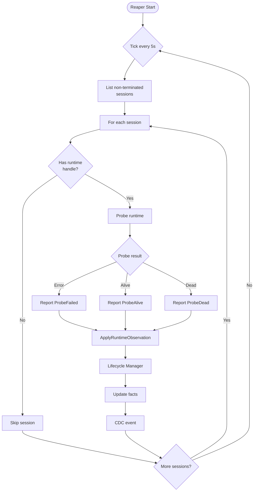

### Observation Integration

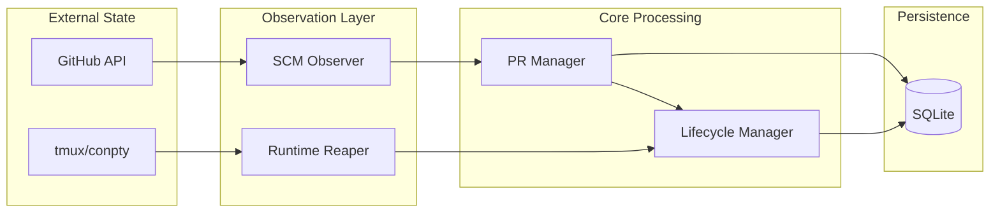

---

## HTTP Layer

### API Structure

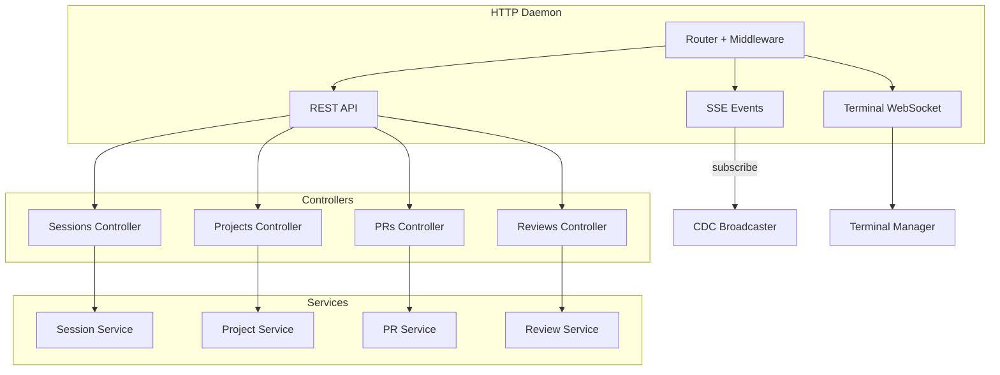

### Request Flow

```mermaid
sequenceDiagram
    participant Client
    participant Router
    participant Controller
    participant Service
    participant Manager
    participant Store
    participant DB

    Client->>Router: POST /api/v1/sessions
    Router->>Router: Middleware (auth, logging)
    Router->>Controller: handler(w, r)
    Controller->>Controller: decode JSON
    Controller->>Service: Spawn(config)
    Service->>Manager: Spawn(config)
    Manager->>Store: Create session
    Store->>DB: INSERT INTO sessions
    DB->>Store: session record
    Store->>Manager: session record
    Manager->>Manager: Create workspace
    Manager->>Manager: Launch runtime
    Manager->>Service: Session response
    Service->>Controller: enriched session
    Controller->>Controller: encode JSON
    Controller->>Client: 201 Created + Session
```

---

## Terminal Multiplexing

### Terminal Architecture

```mermaid
flowchart TD
    subgraph Frontend
        Browser[Browser Terminal]
    end

    subgraph HTTPD
        WS[WebSocket Handler]
    end

    subgraph Terminal
        Mux[Terminal Mux]
        Sessions[Session States]
    end

    subgraph Runtime
        TMux[tmux Runtime]
        ConPTY[conpty Runtime]
    end

    Browser -->|WebSocket| WS
    WS -->|attach| Mux
    Mux --> Sessions
    Sessions -->|create| TMux
    Sessions -->|create| ConPTY

    TMux -->|PTY attach| Mux
    ConPTY -->|loopback dial| Mux

    Mux -->|frame| WS
    WS -->|binary| Browser

```

### Attach Flow

```mermaid
sequenceDiagram
    participant Client as Browser
    participant WS as WebSocket Handler
    participant Mux as Terminal Mux
    participant Runtime as tmux/conpty

    Client->>WS: WebSocket upgrade
    WS->>Mux: Attach(session, rows, cols)
    Mux->>Runtime: Attach(handle, rows, cols)

    Runtime->>Runtime: Create PTY
    Runtime->>Runtime: Spawn tmux attach

    loop Data Loop
        Runtime->>Mux: PTY output
        Mux->>WS: Binary frame
        WS->>Client: WebSocket message

        Client->>WS: User input
        WS->>Mux: Input frame
        Mux->>Runtime: Write to PTY
    end

    Client->>WS: Close
    WS->>Mux: Detach
    Mux->>Runtime: Close PTY
```

---

## Load-Bearing Rules

These rules are **load-bearing** — changing them breaks fundamental architectural assumptions:

1. **Never store display status** — Status is derived from durable facts at read time
2. **Never treat failed probes as death** — A failed probe is a fact, not a termination signal
3. **Never force-delete dirty worktrees** — User data safety over cleanup convenience
4. **All app state under ~/.ao** — No OS-default app-data locations
5. **Daemon binds to 127.0.0.1 only** — No network exposure, ever
6. **CLI is thin** — All logic lives in the daemon, CLI is just an HTTP client
7. **CDC is source-truth for events** — DB triggers write to change_log, poller fans out
8. **Adapters are leaves** — Adapters never import core packages, only ports and domain
9. **Hooks are gitignored** — Every file an adapter writes must be in .gitignore
10. **Migrations never change** — Add new migrations, never modify existing ones

---

## Summary

Agent Orchestrator's architecture is designed around:

- **Separation of concerns** — Observation, persistence, and display are distinct layers
- **Port-based design** — Core code depends on interfaces, not implementations
- **Durable minimalism** — Store only facts, compute everything else
- **Event-driven updates** — CDC broadcasts changes to all subscribers
- **Isolation** — Each session in its own worktree with its own runtime
- **Safety** — Conservative termination, path validation, gitignored hooks

This architecture enables parallel AI agents to work safely while maintaining complete visibility and control.
