# Agent Orchestrator Architecture

Agent Orchestrator is a long-running Go daemon that supervises multiple parallel AI coding agent sessions. Each session runs in an isolated git worktree with its own runtime, while the daemon coordinates lifecycle, observes external state, and routes feedback.

## Table of Contents

- [Mental Model](#mental-model)
- [System Overview](#system-overview)
- [Core Architectural Principles](#core-architectural-principles)
- [Component Architecture](#component-architecture)
- [Data Flows](#data-flows)
- [Persistence and CDC](#persistence-and-cdc)
- [Status Derivation](#status-derivation)
- [Lifecycle Management](#lifecycle-management)
- [Observation Loops](#observation-loops)
- [HTTP Layer](#http-layer)
- [Terminal Multiplexing](#terminal-multiplexing)

---

## Mental Model

The fundamental architecture follows a simple three-stage pipeline:

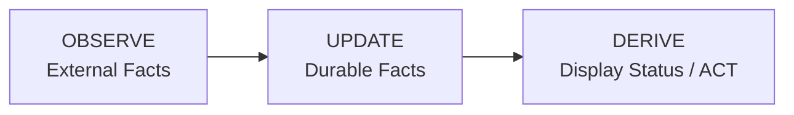
```mermaid
flowchart LR
    A[OBSERVE<br/>External Facts] --> B[UPDATE<br/>Durable Facts]
    B --> C[DERIVE<br/>Display Status / ACT]

```

**Key insight:** Display status is never stored. It is computed at read time from durable facts.

### Durable Session Facts

The only persistent session state is:

- `activity_state` — What the agent last reported (`active`, `idle`, `waiting_input`,
  `parked`, `exited`). `waiting_input` and `parked` are NOT interchangeable:
  `waiting_input` means a permission prompt is open in the pane and the agent is
  blocked on the human, so nothing may be typed at it (a message would be eaten by
  the dialog and its trailing Enter could answer it); `parked` means the turn ended
  and the agent is sitting at an ordinary prompt, listening. Messages for a session
  that cannot receive one are HELD by the message queue, never dropped.
- `is_terminated` — Whether the session should be treated as over. An agent that ends
  its OWN session does NOT always land here: a worker holding a materialized worktree
  from which no pull request was ever opened has delivered nothing, so it is PARKED
  instead and the board reads `needs_input` rather than filing the task as finished.
  A park is `activity_state = 'parked'` plus `is_suspended` with `sleep_reason` of
  `undelivered`, and it keeps the worktree. An ending that does terminate runs the
  same crew fan-out `session_manager.Teardown` runs, so a crew's dev can never
  terminate out from under a live member. A parked session is discarded only
  deliberately: an interactive `Kill` REFUSES (409 `SESSION_HAS_UNDELIVERED_WORK`,
  naming the files, touching nothing) while its worktree holds work no PR carries,
  and `discardUncommitted` captures that work to `refs/ao/preserved/<session-id>`
  before the worktree goes. The background teardowns (auto-reclaim, cleanup,
  project teardown) keep their old policy: preserve the tree and retry later.
- `termination_*` — How the session ended: `source` (`agent` — the harness reported its
  own exit; `ao` — a teardown AO initiated; `runtime_gone` — the reaper inferred it from a
  missing runtime), `reason` (the harness's own end reason, or the named AO cause such as
  `kill` / `auto_reclaim` / `daemon_shutdown` / `discard_work` — the last for a kill
  somebody ordered knowing it would destroy uncommitted work), `last_state`,
  `transcript_path`, and
  `terminated_at`. Written by the lifecycle reducer on every terminal transition and
  cleared on respawn. `activity_state = 'exited'` alone cannot tell a worker that stopped
  by itself mid-task from one AO reclaimed, and that difference is what someone asking
  "why did it disappear?" needs.
- PR facts — `pr`, `pr_checks`, `pr_comment` tables

### What is NOT Durable

Display status like `working`, `needs_input`, `ci_failed`, `mergeable` are **computed at read time** by the service layer from the durable facts above.

---

## System Overview

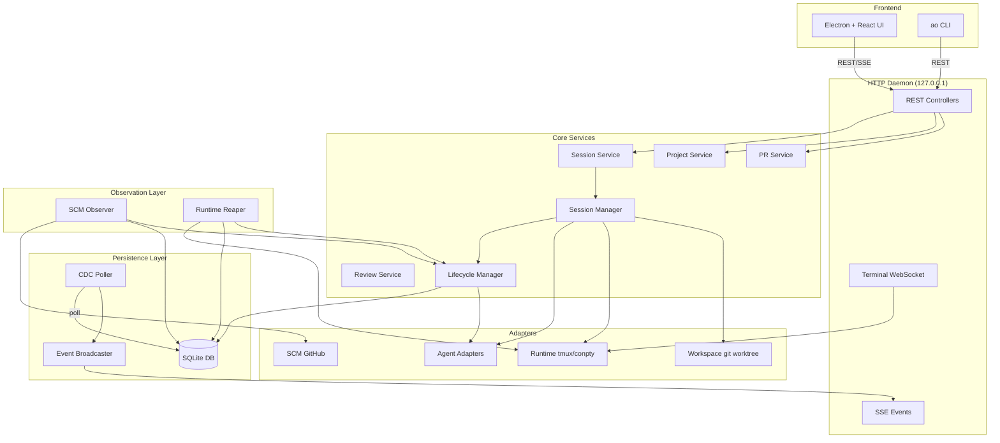
```mermaid
graph TB
    subgraph Frontend
        FE[Electron + React UI]
        CLI[ao CLI]
    end

    subgraph HTTP["HTTP Daemon (127.0.0.1)"]
        Controllers[REST Controllers]
        SSE[SSE Events]
        Terminal[Terminal WebSocket]
    end

    subgraph Core["Core Services"]
        SessionSvc[Session Service]
        ProjectSvc[Project Service]
        PRSvc[PR Service]
        ReviewSvc[Review Service]
        SessionMgr[Session Manager]
        LCM[Lifecycle Manager]
    end

    subgraph Observe["Observation Layer"]
        SCMObserver[SCM Observer]
        Reaper[Runtime Reaper]
    end

    subgraph Storage["Persistence Layer"]
        SQLite[(SQLite DB)]
        CDC[CDC Poller]
        Broadcaster[Event Broadcaster]
    end

    subgraph Adapters["Adapters"]
        AgentAdapter[Agent Adapters]
        RuntimeAdapter[Runtime tmux/conpty]
        WorkspaceAdapter[Workspace git worktree]
        SCMAdapter[SCM GitHub]
    end

    FE -->|REST/SSE| Controllers
    CLI -->|REST| Controllers
    Controllers --> SessionSvc
    Controllers --> ProjectSvc
    Controllers --> PRSvc

    SessionSvc --> SessionMgr
    SessionMgr --> LCM
    SessionMgr --> AgentAdapter
    SessionMgr --> RuntimeAdapter
    SessionMgr --> WorkspaceAdapter

    LCM --> SQLite
    LCM --> AgentAdapter

    SCMObserver --> SCMAdapter
    SCMObserver --> SQLite
    SCMObserver --> LCM

    Reaper --> RuntimeAdapter
    Reaper --> SQLite
    Reaper --> LCM

    CDC -->|poll| SQLite
    CDC --> Broadcaster
    Broadcaster --> SSE

    Terminal --> RuntimeAdapter

```

---

## Core Architectural Principles

### 1. Port-Based Design

Core code never depends on concrete implementations. All external systems are accessed through port interfaces defined in `backend/internal/ports/`:

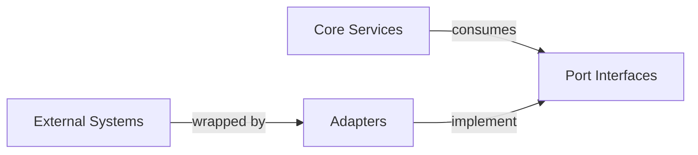
```mermaid
graph LR
    Core[Core Services] -->|consumes| Ports[Port Interfaces]
    Adapters[Adapters] -->|implement| Ports
    External[External Systems] -->|wrapped by| Adapters

```

### 2. Durable Facts, Derived Status

Storage layer persists minimal facts. Service layer computes display status on-demand:

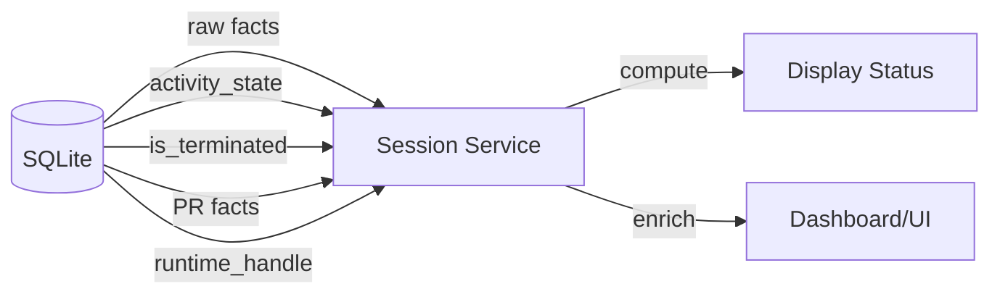
```mermaid
flowchart LR
    SQLite[(SQLite)] -->|raw facts| Service[Session Service]
    Service -->|compute| Status[Display Status]
    Service -->|enrich| UI[Dashboard/UI]

    SQLite -->|activity_state| Service
    SQLite -->|is_terminated| Service
    SQLite -->|PR facts| Service
    SQLite -->|runtime_handle| Service

```

### 3. Observer Pattern

Observation is separated from action:

- **Observe layer** — SCM Observer, Runtime Reaper poll external state
- **Lifecycle layer** — Reduces observations into durable facts
- **Service layer** — Computes display status from facts

### 4. Change Data Capture

All durable changes flow through a CDC pipeline:

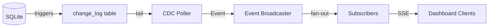
```mermaid
flowchart LR
    DB[(SQLite)] -->|triggers| ChangeLog[change_log table]
    ChangeLog -->|tail| Poller[CDC Poller]
    Poller -->|Event| Broadcaster[Event Broadcaster]
    Broadcaster -->|fan-out| Subscribers[Subscribers]
    Subscribers -->|SSE| Clients[Dashboard Clients]

```

---

## Component Architecture

### Package Layout

```
backend/internal/
├── domain/              # Shared vocabulary and durable fact records
├── ports/               # Inbound/outbound interfaces
├── service/             # Controller-facing services
│   ├── project/         # Project CRUD
│   ├── session/         # Session read-model assembly
│   ├── pr/              # PR observation service
│   └── review/          # Code review service
├── session_manager/     # Internal session command engine
├── lifecycle/           # Durable session fact reducer
├── observe/             # Observation loops
│   ├── scm/             # SCM (GitHub) observer
│   └── reaper/          # Runtime liveness observer
├── storage/             # SQLite persistence
│   └── sqlite/          # DB, migrations, queries, stores
├── cdc/                 # Change-log poller and broadcaster
├── httpd/               # HTTP API, controllers, terminal mux
├── terminal/            # Terminal session protocol
├── adapters/            # Concrete adapter implementations
│   ├── agent/           # 23+ agent harnesses
│   ├── runtime/         # tmux/conpty runtimes + the claude-code socket path
│   ├── workspace/       # git worktree
│   ├── scm/             # GitHub
│   └── tracker/         # GitHub tracker
├── daemon/              # Production wiring
└── config/              # Environment-based configuration
```

### Message delivery

Every message AO injects into a session - `ao send`, lifecycle nudges, review
nudges - goes through one port method, `SendMessage`, on the runtime selected by
`adapters/runtime/runtimeselect`. Queueing, the crew rules and the input gate all
sit above it; the runtime only decides how the bytes reach the agent.

There are two ways they reach it:

- **The pane (tmux `send-keys`).** The default for all 23 harnesses. The message
  is typed into the pane's input line in chunks and submitted with a separate
  Enter, so it competes with whatever the human is typing there.
- **The session's own unix socket (`adapters/runtime/claudepeer`).** Only for
  claude-code, and only on Darwin/Linux. Claude Code registers every running
  session in `~/.claude/sessions/<pid>.json` - including the tmux pane it owns,
  which is what joins it to AO's runtime handle - and listens on a per-session
  socket. Handing the message to that socket leaves the input line alone
  entirely, carries an arbitrarily large message in one frame, and is atomic.

The socket is an undocumented interface with a version on it, so `claudepeer`
wraps the tmux runtime rather than replacing it and falls back to it, quietly and
automatically, on every uncertainty: an unfamiliar `peerProtocol`, a missing or
dead socket, a session that might be in `bypassPermissions` (which parks peer
messages instead of delivering them), a message the receiver's own duplicate and
rate guards would drop, or any incomplete write. The commit point is a complete
write of the frame, so a message lands on exactly one of the two paths, never
both.

`AO_CLAUDE_NATIVE_SEND` chooses how hard AO tries for the socket, for the whole
daemon:

| value                          | behaviour                                                                           |
| ------------------------------ | ----------------------------------------------------------------------------------- |
| unset, or anything below       | **the default:** prefer the socket, fall back to the pane                           |
| `0` / `false` / `FALSE` / `no` | pane only; never touch the socket                                                   |
| `strict`                       | socket only; a send that cannot take it FAILS, naming the reason, and types nothing |

**It is read from the DAEMON's environment, at daemon start** (per send, but from
the process the daemon was launched with). Prefixing a CLI invocation -
`AO_CLAUDE_NATIVE_SEND=0 ao send ...` - sets it in a process that never touches
the transport, so the message goes out the default way while the operator
believes they pinned it. Changing it daemon-wide means restarting the daemon with
it set.

The per-send way in is a pair of flags on `ao send`, which ride the request as
`wire` and govern **that one message only** - nothing sticky, and the default is
untouched when neither is passed:

| flag            | same choice as                 | behaviour                                               |
| --------------- | ------------------------------ | ------------------------------------------------------- |
| `--pane-only`   | `AO_CLAUDE_NATIVE_SEND=0`      | type it into the terminal; never touch the socket       |
| `--socket-only` | `AO_CLAUDE_NATIVE_SEND=strict` | socket or nothing: the send FAILS rather than fall back |

The two are mutually exclusive and refused together. A flag beats the daemon-wide
value for that send, in both directions. A message HELD for a sleeping agent is
delivered later by the queue drain, under whatever the daemon is set to then -
the flag governs the send that carried it, and that send delivered nothing.

Under strict the refusal reaches the caller as `MESSAGE_NOT_DELIVERED`, naming
the control that refused the fallback and the transport's reason:

```
$ ao send --session repo-2 --message "..."          # daemon-wide
send repo-2: message not delivered: AO_CLAUDE_NATIVE_SEND=strict refused the pane
fallback and the claude peer socket could not be used (reason=no-descriptor) ...

$ ao send --session repo-2 --socket-only --message "..."
send repo-2: message not delivered: --socket-only refused the pane fallback and the
claude peer socket could not be used (reason=no-descriptor) ...
```

The default does not force the socket on purpose: the protocol is undocumented,
and if a Claude Code release changed it, a forced-socket default would make every
message in the system vanish silently - far worse than one being typed at
somebody. `strict` is opt-in, for someone deliberately hunting fallbacks.

#### Which wire a message took

The path and the reason are decided inside the transport, on facts only it has,
and the question gets asked hours later - so they are reported, never re-derived
higher up:

- **`ao send` prints it**, and it also rides the API as `delivery` on the send
  response:

  ```
  delivered: socket (claude's own message channel; from @agent-orchestrator-105)
  delivered: pane (typed into the terminal; reason=no-descriptor)
  ```

- **The daemon keeps it**: one JSON line per delivery in
  `<AO_DATA_DIR>/message-delivery.jsonl` (`~/.ao/data/` by default), carrying the
  time, the session, what triggered the send (`send`, `queue-drain`, `nudge`,
  `smoke-report`, `review-notify`, ...), the path, the reason, the sender name, the
  frame's `msg_id` and any error. A send that was PINNED also carries `wire`
  (`pane` / `socket`), so a forced delivery can be told from an ordinary one, and
  a pane line carries `reason: disabled-by-flag` rather than `disabled-by-env`
  when it was the caller's flag and not the daemon's environment. It rolls over at
  4 MiB, keeping one previous generation as `message-delivery.jsonl.1`. Read it
  with `tail`/`jq`.

Every path a message can travel is covered, not only the interactive `ao send`:
the held message drained later, the replay after a daemon restart, a nudge, a
report-back and the reviewer's brief take the same decision, and nobody watches
any of those being delivered.

A message delivered over the socket reaches the agent as a **peer message**,
which the receiving session labels as coming from another Claude session rather
than from its user. That is inherent to the interface: it has no frame that
injects a plain user prompt.

### Session ids, and Claude Code's own session names

Claude Code names every session after its worktree directory plus a random
suffix (`mobility-4734-chat-unsafe-url-whitelist-f5`) and shows the agent THAT
name, so an agent asked to identify itself answers with something that looks
like an AO session id and is not one. Pasted into `ao send` or `ao smoke list`
it used to resolve to nothing.

`controllers.SessionAlias` (mounted once, above `TaskScoped`, on the group that
carries every session route) resolves such a name to the AO session that owns
the same tmux pane and rewrites the `{sessionId}` path parameter, so every
route - and `TaskScoped`, which reads the same parameter - sees an ordinary AO
id. The pane is the only sound join: a crew's dev and qa share a worktree, a
branch and a display name, so cwd cannot tell them apart.

It never changes what a known id means. An id AO already has wins before
Claude's registry is read, and a name matching zero or several live sessions is
passed through so the handler returns its own 404.

Every resolved request carries `X-AO-Session-Resolved: <given> -> <ao id> (tmux
<handle>)`, and the CLI prints it to stderr. That is load-bearing rather than
decorative: because the two crew members are indistinguishable by name, a silent
substitution could message the wrong agent with nothing to show for it.

### Core Data Flow

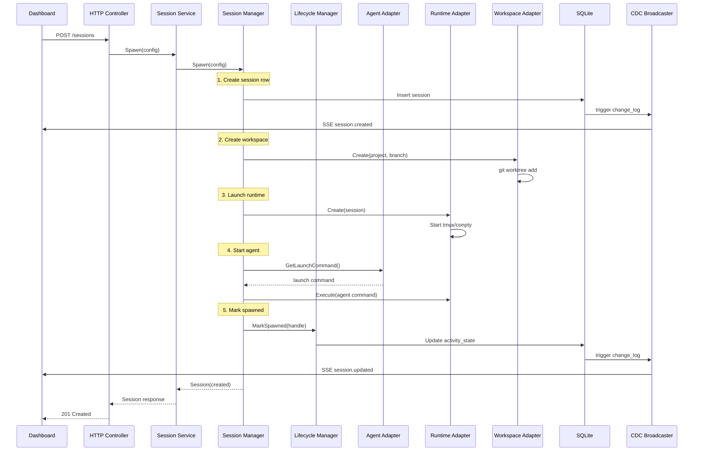
```mermaid
sequenceDiagram
    participant UI as Dashboard
    participant HTTP as HTTP Controller
    participant Svc as Session Service
    participant Mgr as Session Manager
    participant LCM as Lifecycle Manager
    participant Agent as Agent Adapter
    participant Runtime as Runtime Adapter
    participant WS as Workspace Adapter
    participant DB as SQLite
    participant CDC as CDC Broadcaster

    UI->>HTTP: POST /sessions
    HTTP->>Svc: Spawn(config)
    Svc->>Mgr: Spawn(config)

    Note over Mgr: 1. Create session row
    Mgr->>DB: Insert session
    DB->>CDC: trigger change_log
    CDC->>UI: SSE session.created

    Note over Mgr: 2. Create workspace
    Mgr->>WS: Create(project, branch)
    WS->>WS: git worktree add

    Note over Mgr: 3. Launch runtime
    Mgr->>Runtime: Create(session)
    Runtime->>Runtime: Start tmux/conpty

    Note over Mgr: 4. Start agent
    Mgr->>Agent: GetLaunchCommand()
    Agent-->>Mgr: launch command
    Mgr->>Runtime: Execute(agent command)

    Note over Mgr: 5. Mark spawned
    Mgr->>LCM: MarkSpawned(handle)
    LCM->>DB: Update activity_state
    DB->>CDC: trigger change_log
    CDC->>UI: SSE session.updated

    Mgr-->>Svc: Session(created)
    Svc-->>HTTP: Session response
    HTTP-->>UI: 201 Created
```

---

## Data Flows

### Session Spawn Flow

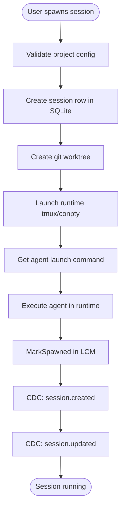
```mermaid
flowchart TD
    Start([User spawns session]) --> Validate[Validate project config]
    Validate --> CreateRow[Create session row in SQLite]
    CreateRow --> CreateWS[Create git worktree]
    CreateWS --> CreateRT[Launch runtime tmux/conpty]
    CreateRT --> GetCmd[Get agent launch command]
    GetCmd --> ExecAgent[Execute agent in runtime]
    ExecAgent --> MarkSpawned[MarkSpawned in LCM]
    MarkSpawned --> Trigger1[CDC: session.created]
    Trigger1 --> Trigger2[CDC: session.updated]
    Trigger2 --> Done([Session running])

```

### Observation Flow

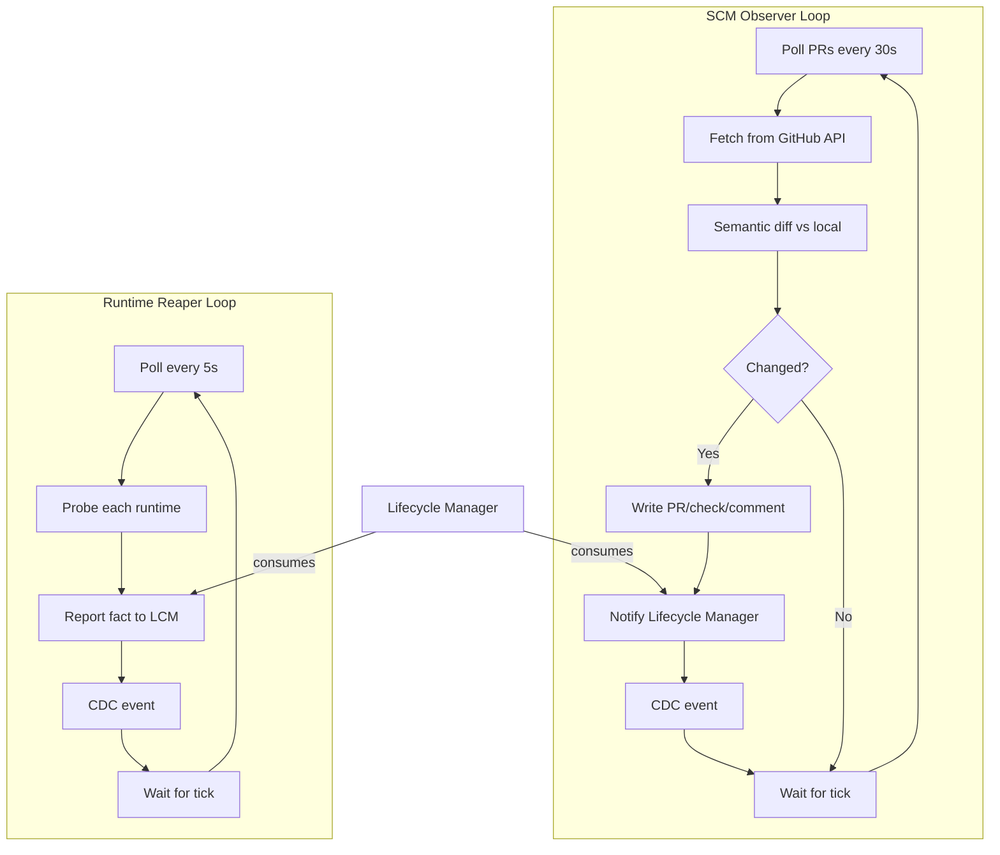
```mermaid
flowchart TD
    subgraph SCM["SCM Observer Loop"]
        Poll1[Poll PRs every 30s]
        Poll1 --> Fetch[Fetch from GitHub API]
        Fetch --> Diff[Semantic diff vs local]
        Diff --> Changed{Changed?}
        Changed -->|Yes| WritePR[Write PR/check/comment]
        Changed -->|No| Wait1[Wait for tick]
        WritePR --> NotifyLCM[Notify Lifecycle Manager]
        NotifyLCM --> Trigger1[CDC event]
        Trigger1 --> Wait1
        Wait1 --> Poll1
    end

    subgraph Reaper["Runtime Reaper Loop"]
        Poll2[Poll every 5s]
        Poll2 --> Probe[Probe each runtime]
        Probe --> Report[Report fact to LCM]
        Report --> Trigger2[CDC event]
        Trigger2 --> Wait2[Wait for tick]
        Wait2 --> Poll2
    end

    LCM[Lifecycle Manager] -->|consumes| NotifyLCM
    LCM -->|consumes| Report

```

### Feedback Routing Flow

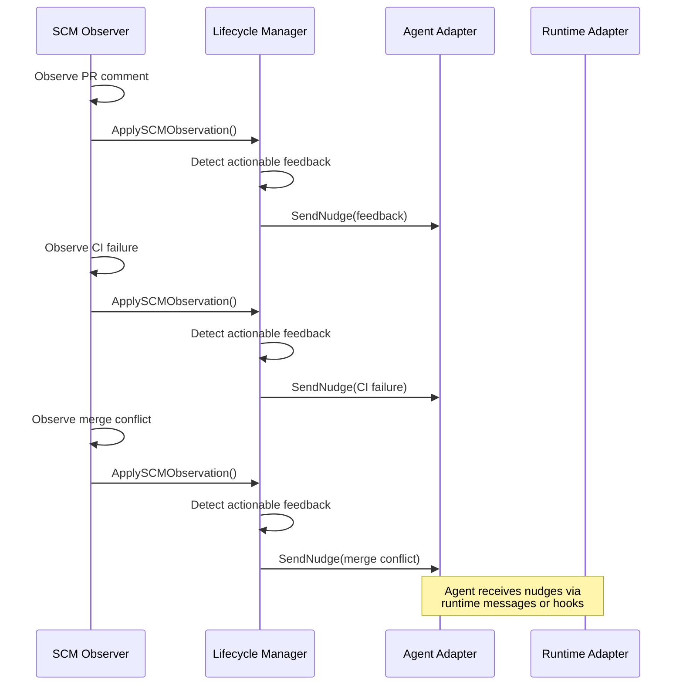
```mermaid
sequenceDiagram
    participant SCM as SCM Observer
    participant LCM as Lifecycle Manager
    participant Agent as Agent Adapter
    participant Runtime as Runtime Adapter

    SCM->>SCM: Observe PR comment
    SCM->>LCM: ApplySCMObservation()
    LCM->>LCM: Detect actionable feedback
    LCM->>Agent: SendNudge(feedback)

    SCM->>SCM: Observe CI failure
    SCM->>LCM: ApplySCMObservation()
    LCM->>LCM: Detect actionable feedback
    LCM->>Agent: SendNudge(CI failure)

    SCM->>SCM: Observe merge conflict
    SCM->>LCM: ApplySCMObservation()
    LCM->>LCM: Detect actionable feedback
    LCM->>Agent: SendNudge(merge conflict)

    Note over Agent,Runtime: Agent receives nudges via<br/>runtime messages or hooks
```

---

## Persistence and CDC

### SQLite Schema

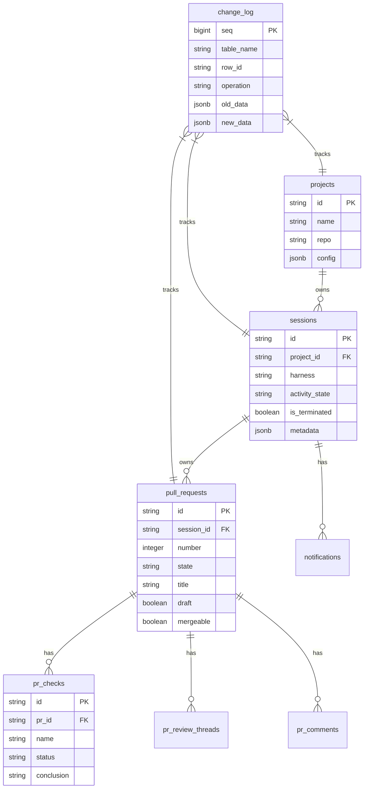
```mermaid
erDiagram
    projects ||--o{ sessions : owns
    sessions ||--o{ pull_requests : owns
    pull_requests ||--o{ pr_checks : has
    pull_requests ||--o{ pr_review_threads : has
    pull_requests ||--o{ pr_comments : has
    sessions ||--o{ notifications : has
    change_log }|--|| projects : tracks
    change_log }|--|| sessions : tracks
    change_log }|--|| pull_requests : tracks

    projects {
        string id PK
        string name
        string repo
        jsonb config
    }

    sessions {
        string id PK
        string project_id FK
        string harness
        string activity_state
        boolean is_terminated
        jsonb metadata
    }

    pull_requests {
        string id PK
        string session_id FK
        integer number
        string state
        string title
        boolean draft
        boolean mergeable
    }

    pr_checks {
        string id PK
        string pr_id FK
        string name
        string status
        string conclusion
    }

    change_log {
        bigint seq PK
        string table_name
        string row_id
        string operation
        jsonb old_data
        jsonb new_data
    }
```

### CDC Pipeline

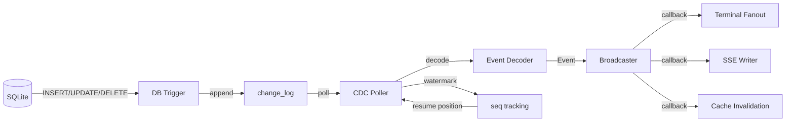
```mermaid
flowchart LR
    DB[(SQLite)] -->|INSERT/UPDATE/DELETE| Trigger[DB Trigger]
    Trigger -->|append| ChangeLog[change_log]
    ChangeLog -->|poll| Poller[CDC Poller]
    Poller -->|decode| Decoder[Event Decoder]
    Decoder -->|Event| Broadcaster[Broadcaster]
    Broadcaster -->|callback| Sub1[Terminal Fanout]
    Broadcaster -->|callback| Sub2[SSE Writer]
    Broadcaster -->|callback| Sub3[Cache Invalidation]

    Poller -->|watermark| Watermark[seq tracking]
    Watermark -->|resume position| Poller

```

---

## Status Derivation

### Display Status Precedence

The `service.Session` computes display status from durable facts using this precedence (highest to lowest):

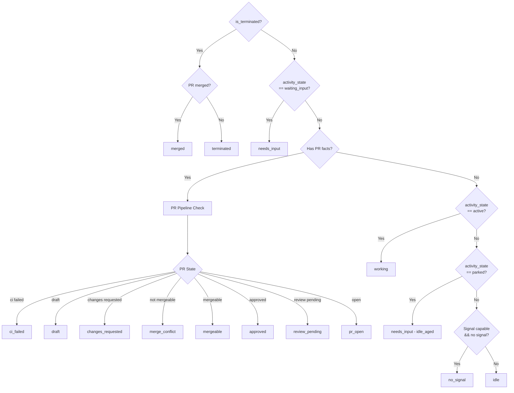
```mermaid
flowchart TD
    CheckTerm{is_terminated?}
    CheckTerm -->|Yes| PRMerged{PR merged?}
    CheckTerm -->|No| CheckWait{activity_state<br/>== waiting_input?}

    PRMerged -->|Yes| Merged[merged]
    PRMerged -->|No| Terminated[terminated]

    CheckWait -->|Yes| NeedsInput[needs_input]
    CheckWait -->|No| CheckPR{Has PR facts?}

    CheckPR -->|Yes| PRPipeline[PR Pipeline Check]
    CheckPR -->|No| CheckActive{activity_state<br/>== active?}

    PRPipeline --> PRState{PR State}
    PRState -->|ci failed| CIFailed[ci_failed]
    PRState -->|draft| Draft[draft]
    PRState -->|changes requested| Changes[changes_requested]
    PRState -->|not mergeable| Conflict[merge_conflict]
    PRState -->|mergeable| Mergeable[mergeable]
    PRState -->|approved| Approved[approved]
    PRState -->|review pending| ReviewPending[review_pending]
    PRState -->|open| PROpen[pr_open]

    CheckActive -->|Yes| Working[working]
    CheckActive -->|No| CheckParked{activity_state<br/>== parked?}

    CheckParked -->|Yes| ParkedNeedsInput[needs_input - idle_aged]
    CheckParked -->|No| CheckSignal{Signal capable<br/>&& no signal?}

    CheckSignal -->|Yes| NoSignal[no_signal]
    CheckSignal -->|No| Idle[idle]

```

### PR Pipeline States

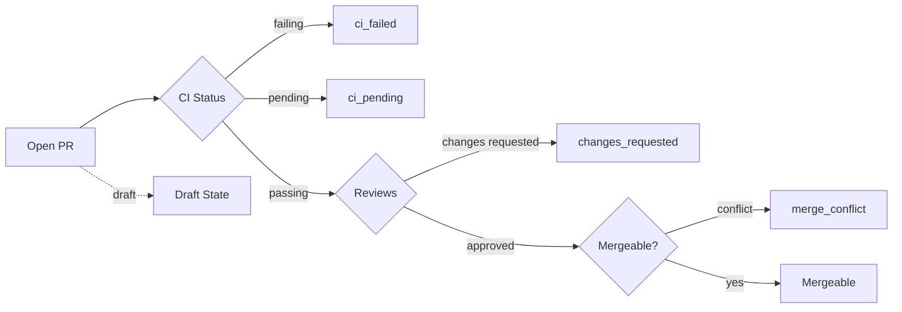
```mermaid
flowchart LR
    PR[Open PR] --> CI{CI Status}
    CI -->|failing| CIFailed[ci_failed]
    CI -->|pending| CIPending[ci_pending]
    CI -->|passing| Review{Reviews}

    Review -->|changes requested| Changes[changes_requested]
    Review -->|approved| Mergeable{Mergeable?}

    Mergeable -->|conflict| Conflict[merge_conflict]
    Mergeable -->|yes| Merged[Mergeable]

    PR -.->|draft| Draft[Draft State]

```

---

## Lifecycle Management

### Lifecycle Manager Responsibilities

The `lifecycle.Manager` is the **canonical write path** for all session lifecycle facts:

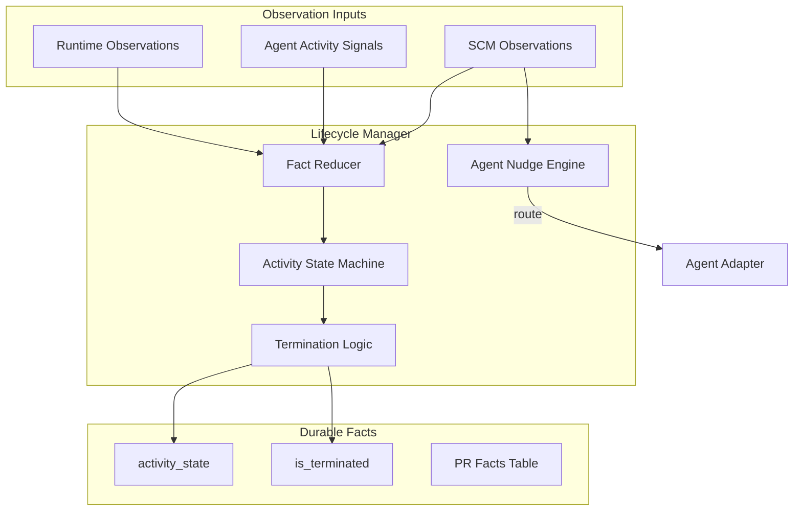
```mermaid
flowchart TD
    subgraph Inputs["Observation Inputs"]
        RuntimeObs[Runtime Observations]
        ActivitySignals[Agent Activity Signals]
        SCMObs[SCM Observations]
    end

    subgraph LCM["Lifecycle Manager"]
        Reducer[Fact Reducer]
        StateMachine[Activity State Machine]
        Termination[Termination Logic]
        Nudge[Agent Nudge Engine]
    end

    subgraph Outputs["Durable Facts"]
        ActivityState[activity_state]
        IsTerminated[is_terminated]
        PRFacts[PR Facts Table]
    end

    RuntimeObs --> Reducer
    ActivitySignals --> Reducer
    SCMObs --> Reducer

    Reducer --> StateMachine
    StateMachine --> Termination
    Termination --> ActivityState
    Termination --> IsTerminated

    SCMObs --> Nudge
    Nudge -->|route| Agent[Agent Adapter]

```

### Session State Machine

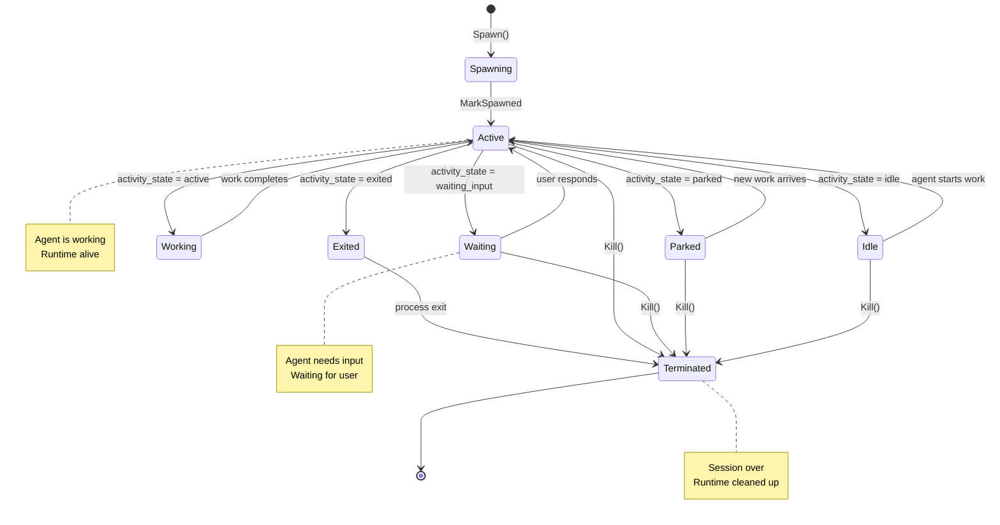
```mermaid
stateDiagram-v2
    [*] --> Spawning: Spawn()
    Spawning --> Active: MarkSpawned
    Active --> Idle: activity_state = idle
    Active --> Working: activity_state = active
    Active --> Waiting: activity_state = waiting_input
    Active --> Parked: activity_state = parked
    Active --> Exited: activity_state = exited
    Working --> Active: work completes
    Waiting --> Active: user responds
    Parked --> Active: new work arrives
    Idle --> Active: agent starts work
    Exited --> Terminated: process exit
    Active --> Terminated: Kill()
    Waiting --> Terminated: Kill()
    Parked --> Terminated: Kill()
    Idle --> Terminated: Kill()
    Terminated --> [*]

    note right of Active
        Agent is working
        Runtime alive
    end note

    note right of Waiting
        Agent needs input
        Waiting for user
    end note

    note right of Terminated
        Session over
        Runtime cleaned up
    end note
```

### Termination Guardrails

The lifecycle manager only terminates when **all** conditions are met:

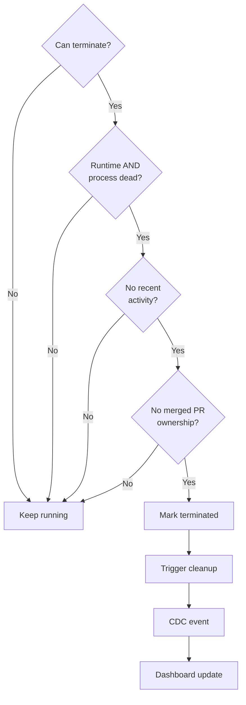
```mermaid
flowchart TD
    Check{Can terminate?}
    Check -->|No| Keep[Keep running]

    Check -->|Yes| AllDead{Runtime AND<br/>process dead?}
    AllDead -->|No| Keep
    AllDead -->|Yes| NoRecent{No recent<br/>activity?}
    NoRecent -->|No| Keep
    NoRecent -->|Yes| NoPR{No merged PR<br/>ownership?}
    NoPR -->|No| Keep
    NoPR -->|Yes| Terminate[Mark terminated]

    Terminate --> Cleanup[Trigger cleanup]
    Cleanup --> CDC[CDC event]
    CDC --> UI[Dashboard update]

```

**Key principle:** Failed probes are NOT proof of death. A session is only terminated when the runtime and process are **both** clearly dead and recent activity doesn't contradict that.

### What ended a session, and what it left behind

A terminated row keeps two words about its ending: `termination_source` (who -
`agent`, `ao`, `runtime_gone`) and `termination_reason` (the harness's own
token, or the AO operation that ordered the teardown). That is deliberately all
the ROW keeps, because it is read on every board refresh.

Two words are not enough to investigate with. On 2026-09-22 three sessions
across two projects ended within 105 milliseconds of each other, all three
recording `agent` / `other` - Claude Code's catch-all - and the cause could not
be established from anything AO had written down. So everything else AO knows at
the moment of an ending goes to a journal off to the side:

- **`<AO_DATA_DIR>/endings.jsonl`**, one JSON line per termination, written by
  the lifecycle reducer at each of its three terminal writes (agent exit,
  runtime gone, and every AO-ordered teardown, which all funnel through
  `MarkTerminated`). It carries the session, project, kind, crew role and
  harness, the source and reason, what the session was doing immediately before
  it stopped, **how long it had been silent** (the field that separates an idle
  timeout from a signal), the transcript's address, **whether the terminal pane
  was still alive at that instant** (probed there, because it stops being true
  if you look later), and **which other sessions ended alongside it**. It rolls
  over at 1 MiB keeping one previous generation, like `message-delivery.jsonl`.
- **An agent that stops is recorded even when the session does not end.** A
  solo or dev worker whose agent ends itself before any PR was opened is
  PARKED (suspended, `sleep_reason = undelivered`, worktree kept) rather than
  terminated, and its row records no termination - the session is not over.
  But its agent did stop, so the journal gets a line for it with
  `"outcome": "parked"`; every terminal write says `"outcome": "terminated"`.
  The journal is the record of agents stopping; `outcome` says what AO then
  did with the row. Parked stops count toward a mass ending: on 2026-09-22
  each event hid one parked session, and those were exactly the ones still
  holding unshipped work.
- **How the agent PROCESS ended.** The SessionEnd hook runs inside the dying
  process and cannot tell a signal from a decision. The pane's leader shell
  can: `ports.RuntimeConfig.ExitStatusFile` makes the tmux launch run a POSIX
  snippet between the agent and the keep-alive shell that appends
  `{"sessionId", "agentExit": {"code", "epoch"}}` to the same `endings.jsonl`.
  `code` is `$?`, which is 128+N when signal N killed the agent. Measured on
  Claude Code 2.1.280: SIGTERM gives `reason: other` + 143, SIGHUP `other` +
  129, SIGINT `other` + 0, SIGKILL no SessionEnd at all + 137, and `/exit`
  gives `prompt_input_exit` + 0. The daemon and the pane each append their
  line the moment they know - neither waits for the other, so a daemon killed
  by the same event loses nothing - and `endingslog.Read` joins each exit
  line onto the nearest ending of the same session (exit within -5 s / +60 s
  of it). An exit with no ending, such as a SIGKILL, becomes an entry of its
  own with an empty `source`. Only agent launches (spawn and restore) opt in;
  reviewer, wiki and iOS-run panes do not.
- **A mass ending is one event, not N endings.** Three or more endings _nobody
  ordered_ inside five seconds raise a daemon `WARN` and are reported by
  **`ao doctor` (`session-endings`)**, which recomputes the grouping from the
  file so it still answers after a restart, and names each session with its
  outcome and exit (`nter-ios-app-79 (parked, SIGTERM)`). Endings AO ordered
  are excluded: a crew teardown ends dev and its members together and an
  auto-reclaim sweep walks a batch, so an alarm that counted those would fire
  on an ordinary afternoon. Exits that no hook reported are counted from the
  file only, since they never reached the daemon.

The hook process still forwards only the harness's bounded reason token, never
the raw SessionEnd payload - that curation boundary is unchanged, and the
payload's remaining fields (`cwd`, `transcript_path`, `session_id`,
`permission_mode`) duplicate facts AO already holds.

**The panes a session spawns go with it.** A session's reviewer pane and its iOS
run pane (`iosrun-<session id>`) are bare runtime handles with no row, no
worktree and no board card, so nothing that sweeps sessions can find them and a
missed reap is permanent. Both are reaped from the lifecycle reducer after every
terminal write, which is what reaches the two routes that never pass through
`session_manager.Teardown`: an agent ending its own session, and the reaper
finding a runtime that is no longer there.

On boot each is swept once more for panes orphaned by a crash, or by a kill
while the daemon was down - `ReapOrphanedReviewers` from the `reviews` table,
and `ReapOrphanedRuns` from the run records under `<AO_DATA_DIR>/iosrun/`.
Enumerating AO's own records rather than tmux is what scopes the sweep: a second
daemon on its own `AO_DATA_DIR` can never reap the first one's panes. A pane
whose session is still LIVE is always left alone - a build that survived a
restart is one somebody is waiting for.

---

## Observation Loops

### SCM Observer

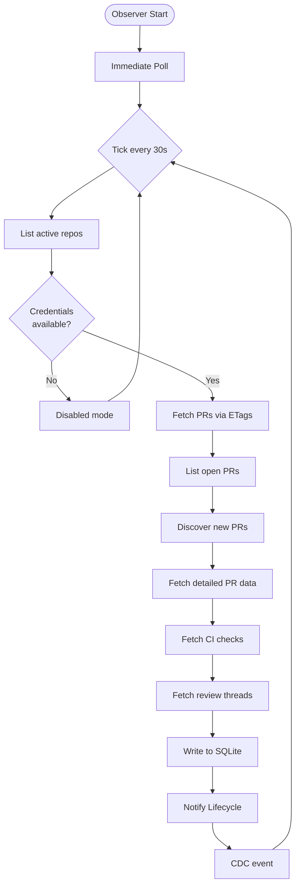
```mermaid
flowchart TD
    Start([Observer Start]) --> Immediate[Immediate Poll]
    Immediate --> Loop{Tick every 30s}

    Loop --> ListRepos[List active repos]
    ListRepos --> CheckCreds{Credentials<br/>available?}
    CheckCreds -->|No| Disabled[Disabled mode]
    CheckCreds -->|Yes| Fetch[Fetch PRs via ETags]

    Fetch --> ListPRs[List open PRs]
    ListPRs --> Discover[Discover new PRs]
    Discover --> FetchDetailed[Fetch detailed PR data]
    FetchDetailed --> FetchChecks[Fetch CI checks]
    FetchChecks --> FetchReviews[Fetch review threads]

    FetchReviews --> Write[Write to SQLite]
    Write --> Notify[Notify Lifecycle]
    Notify --> Trigger[CDC event]

    Disabled --> Loop
    Trigger --> Loop

```

### One tmux server per session

On macOS/Linux every session's pane runs on a tmux server of its own, reached
through an explicit socket under the data dir: `<dataDir>/tmux/<session-name>`
(`backend/internal/adapters/runtime/tmux/socket.go`). Every command the runtime
runs - create, probe, send, capture, attach, kill - names that socket with `-S`.

The reason is `$TMUX`. tmux exports it into each pane, naming the server that
hosts the pane, and a tmux client that sees it talks to that server whatever
`TMUX_TMPDIR` or `-L` say. While every session shared the user's default server,
one `tmux kill-server` typed in any pane - on 2026-10-01, an agent tearing down a
sandbox with `TMUX_TMPDIR=<sandbox> tmux kill-server` - ended every session of
every project at once. With a server per session it can end only its own
session. `$TMUX` is deliberately left in the pane: Claude Code records its tmux
target from it, and claudepeer delivery joins AO's handle on that record.

Rooting the sockets in the data dir also isolates AO instances from each other:
a sandbox or e2e run with its own `AO_DATA_DIR` gets its own servers, and its
sessions cannot share a name with the real instance's.

Sessions created before this change still live on tmux's default server. The
runtime reaches them there (`tmux.Options.LegacySocket`) only when a session has
no socket of its own AND its pane was launched from this instance's launch-script
directory, so a sandbox never adopts the real instance's sessions; a new session
under the same name retires a stale one there first, and refuses while a live
agent still runs in it.

To attach by hand: `tmux -S ~/.ao/data/tmux/<session-name> attach -t <session-name>`
(`ao spawn` prints it).

When an agent reports its own ending (SessionEnd) and its pane is already gone,
the runtime died under it rather than the agent choosing to stop - an agent that
quits leaves its pane behind, held by the keep-alive shell. The lifecycle reducer
then does not run the crew fan-out for a dev (its qa is left for a restore), and
`ao doctor` names a mass ending whose panes all went with their agents as a lost
runtime and lists the `ao session restore` commands.

### Runtime Reaper

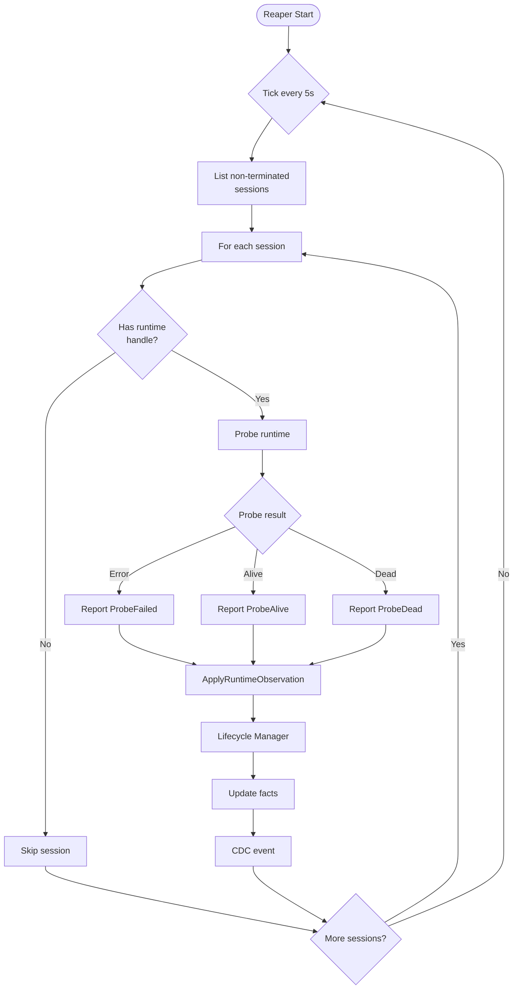
```mermaid
flowchart TD
    Start([Reaper Start]) --> Loop{Tick every 5s}

    Loop --> List[List non-terminated<br/>sessions]
    List --> ForEach[For each session]

    ForEach --> GetHandle{Has runtime<br/>handle?}
    GetHandle -->|No| Skip[Skip session]
    GetHandle -->|Yes| Probe[Probe runtime]

    Probe --> Result{Probe result}
    Result -->|Error| ReportFailed[Report ProbeFailed]
    Result -->|Alive| ReportAlive[Report ProbeAlive]
    Result -->|Dead| ReportDead[Report ProbeDead]

    ReportFailed --> Apply[ApplyRuntimeObservation]
    ReportAlive --> Apply
    ReportDead --> Apply

    Apply --> LCM[Lifecycle Manager]
    LCM --> Update[Update facts]
    Update --> CDC[CDC event]

    Skip --> NextSession{More sessions?}
    CDC --> NextSession
    NextSession -->|Yes| ForEach
    NextSession -->|No| Loop

```

### Observation Integration

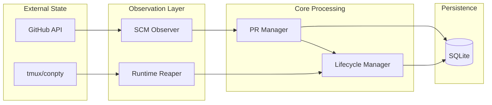
```mermaid
flowchart LR
    subgraph External["External State"]
        GitHub[GitHub API]
        Runtimes[tmux/conpty]
    end

    subgraph Observers["Observation Layer"]
        SCM[SCM Observer]
        Reaper[Runtime Reaper]
    end

    subgraph Core["Core Processing"]
        LCM[Lifecycle Manager]
        PRMgr[PR Manager]
    end

    subgraph Storage["Persistence"]
        SQLite[(SQLite)]
    end

    GitHub --> SCM
    Runtimes --> Reaper

    SCM --> PRMgr
    PRMgr --> SQLite
    PRMgr --> LCM

    Reaper --> LCM
    LCM --> SQLite

```

### Learning capture

The human teaches workers in the pane - corrections, rules, the steps of a flow, the reason behind a decision - and none of it survives into a final report. Claude Code deletes a transcript 30 days after it was last written. Learning capture keeps those turns so a later stage can propose memories from them. It calls no model.

It is opt-in per project (`ProjectConfig.LearnFromSessions`, `ao project set-config --learn-from-sessions`) and the switch is a hard gate: for a project that has it off, no transcript is opened, no prompt or delivery fingerprint is recorded, nothing is stored.

**The contract.** This is the one place AO reads transcript CONTENT; `claudecode/usage.go` still reads aggregate token counts only.

- _What is read:_ the project's Claude Code transcripts - the file AO pinned with `--session-id`, files a session's hooks reported, and other files in the worktree's directory whose recorded `cwd` is that worktree (a `/clear` continuation). Each file is read from a stored byte offset with `Seek`, never whole.
- _What is kept:_ only the human's own turns (`learn_excerpt`), redacted, each with a bounded window - the agent's nearest words (1,500 bytes before, 800 after) and a curated action list (tool name plus one whitelisted target, as the activity feed shows them; never a command line, a file body or a tool result). Turns that are not the human's - the spawn brief, another session's `ao send`, AO's nudges and notices, task notifications - are recognised and skipped.
- _Redaction_ (`internal/learn/redact`): exact secret values AO already knows (test-account credentials in each mobile project's script store, secret-named env values), high-precision token formats and secret assignments, emails and Thai id/phone shapes, and pasted blobs collapsed to their size. No generic digit rule: timestamps, ids and line numbers survive.
- _Where it goes:_ capture keeps it in AO's SQLite under `~/.ao`. Collect (below) sends batches of the **redacted** excerpts - never a transcript - to Anthropic's API through the human's own `claude` CLI login, the same destination the sessions themselves use. `ao learn forget` deletes a project's capture, drafts and runs once its switch is off.

**Telling the human from AO.** Claude Code tags every user turn with `origin.kind` (`human`, `peer`, `task-notification`, ...), but text AO types into the pane is tagged `human` too. So AO records, at delivery, a fingerprint and an author for everything it puts into a session (`delivered_fingerprint`, written by `runtimeMessenger.Send`): `human` for the app's send box, a person's `ao send` outside any session and the Tests tab's report; `agent` for a `[from @<id>]` send; `ao` for nudges and notices. The session's brief is matched by the fingerprint of `sessions.prompt`. A fingerprint is a sha256 of the text with whitespace collapsed (`internal/learn/fingerprint`) - the body itself is never stored.

**Bookkeeping from hooks.** `ao hooks claude-code` reports, on session start, prompt submit, stop and end, the transcript path and native id on its own route (`POST /sessions/{id}/transcript-ref`) - not on `/activity`, whose contract forbids paths and native ids. On a prompt submit it adds the prompt's fingerprint, computed inside the hook process. Capture stamps each such fingerprint when it reads the matching typed turn; `ao learn status` reports prompts that stay unmatched, which is the canary for a change in Claude Code's undocumented transcript format.

**Exactly-once.** A pass over one file lands its excerpts, the prompt matches and the advanced cursor in one transaction (`CommitLearnPass`), and `(transcript_path, turn_uuid)` is unique, so a crash or a rewritten file never loses or duplicates a turn. A human turn whose answer is still being written is left open: the cursor stops at it and carries its "before" window to the next pass. The loop (`observe/learncapture`, every 10 minutes, `learn-capture` in `/daemon/loops`) is additive like the token-usage observer and never touches lifecycle; a failing file is recorded on its cursor and reported by `ao learn status`.

**Collect** (`observe/learncollect`, every 10 minutes, `learn-collect` in `/daemon/loops`) turns captured turns into **drafts** - candidate lessons (`learn_draft`) - and records every model run (`learn_job`) with its cost, and its error and stderr tail when it fails. It reads excerpts, never transcripts, and collects a session once the human has gone quiet in it (newest uncollected turn 15 minutes old) or the oldest has waited 2 hours. One batch (at most 30 turns / 60 KB) is one sealed `claude -p` call (`internal/learn/llm`): `--setting-sources ""` (no user CLAUDE.md, plugins or their hooks), `--tools ""` (the model cannot act), an empty MCP config, no slash commands, `--no-session-persistence` (no transcript of the call), JSON-schema output, an empty temporary cwd and no `AO_*` variables. The model only proposes; `internal/learn/collect` keeps a lesson only if its quote is a substring of a human turn in the batch (the model's turn reference is a tie-break, never trusted), marks one resting only on an accepted suggestion as weak, and resolves "supersedes" only to an open draft of the same session. Each draft also carries the model's `about` tag - `agent_practice` (how agents should work), `product_decision`, `one_off` or `question` - so the decide stage can weigh the usual false lessons instead of collect dropping them: telling the model to leave them out cost about 30% of the real lessons in a labelled evaluation, while tagging kept them and separated the two. Drafts, collected marks and the run land in one transaction. The background loop stops for the local day at `learning-settings.json`'s `dailyBudgetUSD` (default $2, as `total_cost_usd` reports it), a failing session backs off (30 minutes, doubling), and a pass ends after three failed runs in a row; `ao learn collect --budget N` processes a backlog at once under its own budget.

**Standing rules** (`observe/learnrules`, hourly, `learn-rules` in `/daemon/loops`) keep a corpus of the rules agents are already told, so a candidate lesson can be checked against them before it is ever proposed. While at least one project learns from sessions, the sources are the human's `~/.claude/CLAUDE.md` and `~/.claude/skills/*/SKILL.md`, AO's own installed skills, and for each learning project its repo `CLAUDE.md`, `AGENTS.md` and `.claude/skills`, AO's assembled standing prompt for an orchestrator and a worker of the project (`Manager.StandingPrompts`), the knowledge `~/.ao/knowledge/<project>/INDEX.md`, and the project's Claude Code memory (`~/.claude/projects/<repo>/memory/*.md`, the main checkout's, so every worktree shares it). Repo files are only read. Each source is cut at its H1/H2 headings into chunks of at most 24 KB; a chunk is atomized once by the same sealed `claude -p` call (Haiku by default, `rulesModel`) and cached in `learn_rule_chunk` by the hash of its text, so an unchanged source costs nothing, an edit re-atomizes only the chunks it touched and a chunk shared by two files is sent once. The knowledge INDEX is split per entry and each memory file is one rule, both without a model. `internal/learn/rules` keeps a rule only if its quote is in the chunk (an invented rule would later read as a conflict that is not there). These files are the same text every session already sends to the API when it loads them, so atomizing sends nothing new; the source text itself is not stored. Runs count against the same daily budget as collect; a chunk whose run failed backs off (an hour, doubling to a day); a chunk no source uses is pruned after two days, its row being the record of what it cost. Retrieval is BM25 over each rule's text, heading and tags (`ao learn rules --search`). The human pins **protected rules** (`learn_protected_rule`, `ao learn rules protect`), global or per project, optionally with RE2 forbidden patterns; `rules.Forbidden` is the deterministic gate every proposed change must pass, and a pattern that no longer compiles blocks rather than passes.

**Decide** (`observe/learndecide`, every 30 minutes, `learn-decide` in `/daemon/loops`) turns a finished task's open drafts into **proposals** (`learn_proposal`) for the human; nothing is applied. A lesson of one project goes in the project's Claude Code memory - a new memory file in Claude Code's own format plus its one-line pointer in `MEMORY.md`, or a change to an existing memory file - because that memory already reaches every session of the repo; a rule for every project goes in `~/.claude/CLAUDE.md`; a lesson that belongs in one of the human's own skills changes that skill; the knowledge store is never a target. For a CLAUDE.md edit the model gives only the lines; AO inserts them, starting from the open proposal on the same file and rendering again at commit time, so an amendment never loses a line an earlier task proposed; a full-file skill update that would drop such a line is refused. A task (`crew:`, `solo:` or an orchestrator's `orch:<project>:<day>`) is ready when its sessions have ended - `merged` (a PR merged, `work_complete`, or asleep as merged), `abandoned` (kill, discard, issue closed, PR closed unmerged) or, after 48 hours without a merge, `unknown` - when a session that never ends has a draft a day old (`ongoing`), or when an orchestrator's day is over. One sealed `claude -p` call (Opus 5.5 by default, `decideModel` / `decideEffort`) gets, within 40 KB, the task's drafts, the most similar drafts of other tasks, the top standing rules and every protected rule, the skill index (user, plugin, AO and repo skills) with the bodies of the closest three, the global CLAUDE.md's headings, and the open and rejected proposals. A second call with an adversarial prompt checks every proposal: one that contradicts or works around a rule becomes a **conflict card**, one not grounded in the human's own words or carrying sensitive data is dropped. Then `internal/learn/decide` applies the gates no model can talk past: cited drafts must be ones it was given, include one of this task and one the human typed; a proposal needs a draft tagged `agent_practice` (or untagged) at confidence 0.65 or more, or the same lesson from another task; drafts tagged product decision, one-off or question and accepted suggestions never count; `global` scope needs evidence from two projects or the human saying "always" / "every project", and a project lesson never changes a skill or CLAUDE.md every project loads; targets are confined, through symlinks, to the project's memory directory, existing user skills under `~/.claude/skills` and `~/.claude/CLAUDE.md` (an orchestrator's day may not edit CLAUDE.md: that becomes a conflict card); a memory file is rendered by AO (frontmatter, a description of at most 300 bytes, a body of at most 8 KB) and never overwrites an existing one; a skill change must still parse, keep its name and say "Use when"; the same new memory taught again by another task adds its lines to the open proposal; anything a protected rule's pattern forbids becomes a conflict card; the redaction dictionary and patterns must find nothing; em dashes are replaced. A rule file is never rewritten: the model names the heading and the lines, AO inserts them. AO computes the diff against the file as it is and records its hash. A proposal on a target that already has a pending one amends it; one whose evidence a rejected proposal on the same target already had is dropped. Refused proposals are kept as `dropped` with the reason. Drafts a kept proposal rests on become `consumed`, the task's others `dropped`. Both calls are `learn_job` rows (`kind` decide / verify) under the daily budget; a failing task backs off. `ao learn decide` runs it now, `ao learn proposals [show <id>]` reads the result.

**Deciding a proposal** (`service/learning` decisions, `internal/learn/apply`; the Memory inbox `/memory` and `ao learn approve|reject|snooze|unsnooze|reopen|undo|edit`). Approve writes under `~/.claude` only - a project's memory file plus its `MEMORY.md` line, a memory or skill of the person's, their `CLAUDE.md` - confined through symlinks: it refuses a target that changed after the proposal was made (the proposal goes `stale`, its drafts reopen and decide proposes again against the file as it is), backs up what it replaces under `<dataDir>/learn-history/`, writes through a synced temp file and a rename, and re-runs the gates on an edit (format, forbidden patterns, sensitive values, em dash). A conflict card records the side that won; a pinned rule takes the newer words and keeps its patterns, any other rule's file is left to the person (AO never writes a repo file). Reject keeps the reason, which decide reads; snooze hides a pending proposal for up to 90 days, and a lesson taught again brings it back.

No decision is final. A snoozed proposal can be approved, edited or rejected as it is, or unsnoozed; a rejected one (a conflict whose rule was kept included) reopened; an applied one edited (the same gates, measured against the file as it is now) or undone - a new memory's file and the `MEMORY.md` line its approve added are removed, a changed file gets back the version the approve replaced (`applied_before`; rows applied before that column read the `learn-history` backup made at `decided_at`), a pinned rule its earlier text - and goes back to pending. What AO wrote is only taken back or rewritten while it is still what AO wrote (the file's hash is `applied_sha256` and the index line is still there); otherwise nothing is touched and the caller gets `409 PROPOSAL_CHANGED` with the diff (written to now) and a token naming that exact state, and confirms by sending the token back - so a change made after the review is never overwritten unseen. A proposal never goes back to pending while another pending one targets the same file (the unique index), and a new memory whose file exists is never reopened, so nothing is written twice. Every decision is a `learn_proposal_event` row (kind, status after, note, snooze date, via `app` / `cli` / `api` and the AO session that ran the CLI), written in the same transaction as the status change.

---

## HTTP Layer

### API Structure

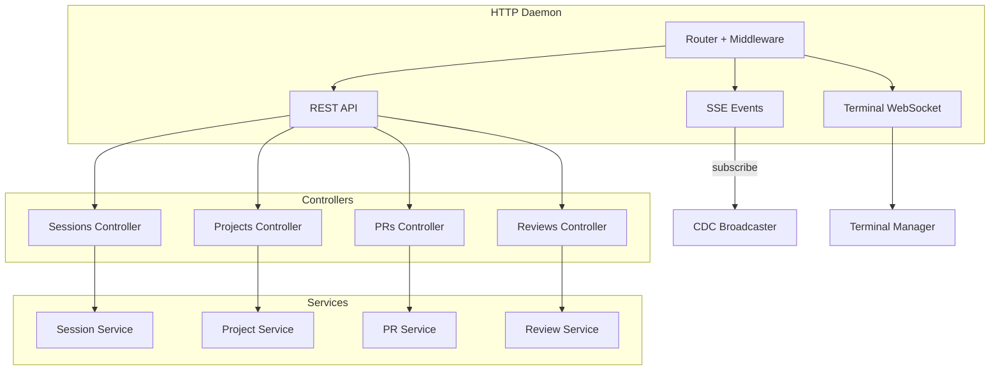
```mermaid
flowchart TD
    subgraph HTTPD["HTTP Daemon"]
        Router[Router + Middleware]

        Router --> API[REST API]
        Router --> Events[SSE Events]
        Router --> Terminal[Terminal WebSocket]
    end

    subgraph Controllers["Controllers"]
        Sessions[Sessions Controller]
        Projects[Projects Controller]
        PRs[PRs Controller]
        Reviews[Reviews Controller]
    end

    subgraph Services["Services"]
        SessionSvc[Session Service]
        ProjectSvc[Project Service]
        PRSvc[PR Service]
        ReviewSvc[Review Service]
    end

    API --> Sessions
    API --> Projects
    API --> PRs
    API --> Reviews

    Sessions --> SessionSvc
    Projects --> ProjectSvc
    PRs --> PRSvc
    Reviews --> ReviewSvc

    Events -->|subscribe| CDC[CDC Broadcaster]
    Terminal --> TerminalMux[Terminal Manager]

```

### Request Flow

```mermaid
sequenceDiagram
    participant Client
    participant Router
    participant Controller
    participant Service
    participant Manager
    participant Store
    participant DB

    Client->>Router: POST /api/v1/sessions
    Router->>Router: Middleware (auth, logging)
    Router->>Controller: handler(w, r)
    Controller->>Controller: decode JSON
    Controller->>Service: Spawn(config)
    Service->>Manager: Spawn(config)
    Manager->>Store: Create session
    Store->>DB: INSERT INTO sessions
    DB->>Store: session record
    Store->>Manager: session record
    Manager->>Manager: Create workspace
    Manager->>Manager: Launch runtime
    Manager->>Service: Session response
    Service->>Controller: enriched session
    Controller->>Controller: encode JSON
    Controller->>Client: 201 Created + Session
```

---

## Terminal Multiplexing

### Terminal Architecture

```mermaid
flowchart TD
    subgraph Frontend
        Browser[Browser Terminal]
    end

    subgraph HTTPD
        WS[WebSocket Handler]
    end

    subgraph Terminal
        Mux[Terminal Mux]
        Sessions[Session States]
    end

    subgraph Runtime
        TMux[tmux Runtime]
        ConPTY[conpty Runtime]
    end

    Browser -->|WebSocket| WS
    WS -->|attach| Mux
    Mux --> Sessions
    Sessions -->|create| TMux
    Sessions -->|create| ConPTY

    TMux -->|PTY attach| Mux
    ConPTY -->|loopback dial| Mux

    Mux -->|frame| WS
    WS -->|binary| Browser

```

### Attach Flow

```mermaid
sequenceDiagram
    participant Client as Browser
    participant WS as WebSocket Handler
    participant Mux as Terminal Mux
    participant Runtime as tmux/conpty

    Client->>WS: WebSocket upgrade
    WS->>Mux: Attach(session, rows, cols)
    Mux->>Runtime: Attach(handle, rows, cols)

    Runtime->>Runtime: Create PTY
    Runtime->>Runtime: Spawn tmux attach

    loop Data Loop
        Runtime->>Mux: PTY output
        Mux->>WS: Binary frame
        WS->>Client: WebSocket message

        Client->>WS: User input
        WS->>Mux: Input frame
        Mux->>Runtime: Write to PTY
    end

    Client->>WS: Close
    WS->>Mux: Detach
    Mux->>Runtime: Close PTY
```

---

## Load-Bearing Rules

These rules are **load-bearing** — changing them breaks fundamental architectural assumptions:

1. **Never store display status** — Status is derived from durable facts at read time
2. **Never treat failed probes as death** — A failed probe is a fact, not a termination signal
3. **Never force-delete dirty worktrees** — User data safety over cleanup convenience
4. **All app state under ~/.ao** — No OS-default app-data locations
5. **Daemon binds to 127.0.0.1 only** — No network exposure, ever
6. **CLI is thin** — All logic lives in the daemon, CLI is just an HTTP client
7. **CDC is source-truth for events** — DB triggers write to change_log, poller fans out
8. **Adapters are leaves** — Adapters never import core packages, only ports and domain
9. **Hooks are gitignored** — Every file an adapter writes must be in .gitignore
10. **Migrations never change** — Add new migrations, never modify existing ones

---

## Summary

Agent Orchestrator's architecture is designed around:

- **Separation of concerns** — Observation, persistence, and display are distinct layers
- **Port-based design** — Core code depends on interfaces, not implementations
- **Durable minimalism** — Store only facts, compute everything else
- **Event-driven updates** — CDC broadcasts changes to all subscribers
- **Isolation** — Each session in its own worktree with its own runtime
- **Safety** — Conservative termination, path validation, gitignored hooks

This architecture enables parallel AI agents to work safely while maintaining complete visibility and control.
